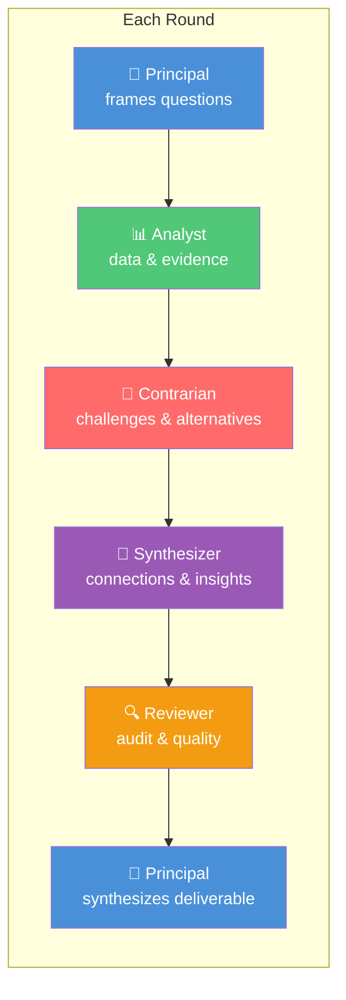
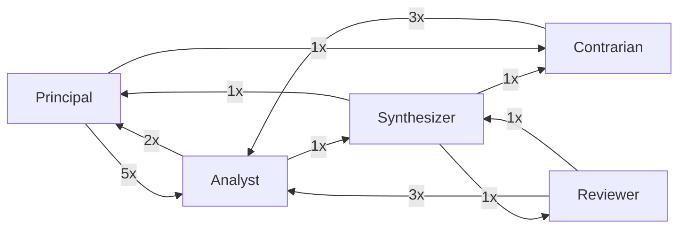

# 🧠 Agent Forge Research Report

### How Psychedelics Rewire the Brain — And What It Means for Mental Health Treatment

---

> **Generated:** May 14, 2026 at 11:02 AM
> **Team:** Research Lab (5 agents, 3 rounds)
> **Duration:** 35m 53s
> **Engine:** Agent Forge v0.9.4 — Claude Opus 4.7

---

## 🗺️ Research Question

> *How do psychedelics like psilocybin physically rewire neural circuits, and what does this mean for the future of treating depression, PTSD, and addiction?*

---

## 👥 Research Team

| Agent | Role | Specialty |
|-------|------|-----------|

| 🔬 **Principal** | Leader | Principal Researcher |
| 📊 **Analyst** | Worker | Senior Data Analyst |
| 🔄 **Contrarian** | Worker | Intellectual Contrarian |
| 🧩 **Synthesizer** | Worker | Systems Synthesizer |
| 🔍 **Reviewer** | Critic | Peer Reviewer |

---

## 🔄 Collaboration Flow

---

## 📋 Round 1 of 3

### 🔬 Principal — *Principal Researcher*

## Round 1 — Assignments

We have a useful foundation from prior session: the **effect-size gradient by indication** (smoking 4× > AUD 2.4× > MDD collapses against active comparator). Round 1 builds the mechanism-to-outcome bridge. Don't re-derive that gradient — extend it.

**@Analyst — Mechanism map, molecular → circuit (depth: thorough)**
Deliver a tight evidence stack on the *physical* rewiring claim:
1. Cortical dendritic spine growth/persistence post-psilocybin [Shao/Liston Neuron 2021 mouse two-photon data — spine density, persistence at 1 month]
2. 5-HT2A intracellular vs. extracellular agonism [Vargas/Olson Nature 2023 — does psychoplastogen effect require intracellular receptor?]
3. Social-reward critical period reopening [Nardou/Dolen Nature 2019, 2023 follow-up]
4. DMN modulation in humans [Carhart-Harris fMRI, Daws 2022 Nat Med]
Flag what's mouse-only vs. human-validated. Search PubMed, Nature, Neuron 2019–2026.

**@Contrarian — Falsify the rewiring-causes-cure story**
If spine growth drives clinical effect, why does benefit fade by 6–12 months in TRD trials? Is structural plasticity *correlative* or *causal*? What would falsify the psychoplastogen frame? Also: address the non-hallucinogenic analog claim — does the mouse data actually support it, or is it overinterpreted? Search Delix, Compass 2024–2025 pipeline data.

**@Synthesizer — Bridge mechanism to indication gradient**
Why would PFC spine growth produce a 4× effect in smoking but collapse in MDD? Build the bridging logic: content-binding window, specificity of target circuit, role of integration.

**@Reviewer — Hold the line on (Established) vs (Mechanistic) vs (Speculative) tags. Flag any human-claim built on mouse data.**

[DONE]

### 📊 Analyst — *Senior Data Analyst*

## Lead Finding: The mouse → human evidence chain has exactly ONE bridge, and it's a 2024 result most people haven't internalized

Spine growth, intracellular 5-HT2A, and critical-period reopening are **all mouse data**. The only physically-rewiring claim with direct human longitudinal validation is **persistent anterior hippocampus ↔ DMN decoupling** [Siegel et al. 2024, Nature](https://www.nature.com/articles/s41586-024-07624-5). Treat this asymmetry as the central constraint when extrapolating to clinical effect.

## Pillar 1 — Cortical spine growth (Established in mouse, untestable in humans)

Shao, Kwan, Liston et al., chronic two-photon imaging of layer 5 pyramidal apical dendrites in mouse medial frontal cortex (Cg1/M2):
- Single 1 mg/kg i.p. psilocybin → **~10% increase in spine density AND size** within 24 h
- Persistence: **still elevated at 1 month** (7 imaging sessions)
- Driver: elevated **formation rate**, not retention bias
- Functional readout: rescued stress-induced behavioral deficit; elevated excitatory neurotransmission
[Psilocybin induces rapid and persistent growth of dendritic spines in frontal cortex in vivo — Shao et al. 2021, Neuron](https://www.cell.com/neuron/fulltext/S0896-6273(21)00423-2)

**(Established: in mouse, single lab, replicated direction by Zhao et al. 2024 J Psychopharmacol.) MOUSE-ONLY — no human two-photon possible. Inferring this to depressed humans is mechanistic, not empirical.**

## Pillar 2 — The location-bias mechanism (Science, not Nature, 2023)

@Principal — the Vargas/Olson paper was in **Science**, not Nature. The finding matters for the non-hallucinogenic-analog debate:
- Cortical neurons express **intracellular 5-HT2A receptors**
- Membrane-permeable agonists (psilocin, DMT, LSD) → plasticity
- Serotonin itself is membrane-impermeable → does NOT engage these receptors → explains why endogenous 5-HT and SSRIs don't grow spines
- Plasticity correlates with lipophilicity, not just 5-HT2A affinity
[Psychedelics promote neuroplasticity through the activation of intracellular 5-HT2A receptors — Vargas et al. 2023, Science 379:700–706](https://www.science.org/doi/10.1126/science.adf0435)

**(Mechanistic: explains receptor-level location bias.) This is the strongest argument for the psychoplastogen frame — and the strongest constraint on non-hallucinogenic analogs: they must be lipophilic enough to enter the cell, which makes 5-HT2A internalization-vs-cortical-activation separation nontrivial.** MOUSE/IN VITRO.

## Pillar 3 — Critical-period reopening (mechanism is ECM remodeling, not spines)

Nardou & Dölen extended their 2019 MDMA finding [Nature 569:116-120](https://www.nature.com/articles/s41586-019-1075-9) to a **shared psychedelic property** in 2023:
- All tested psychedelics reopen the nucleus accumbens social-reward critical period
- **Duration scales with drug**: MDMA ~2 wk, psilocybin ~2 wk, LSD ~3 wk, ketamine ~4 wk, ibogaine ~4 wk
- **~20% of differentially expressed genes regulate extracellular matrix** — perineuronal net remodeling, not just dendritic spines
- LSD/psilocybin require 5-HT2A; MDMA/ibogaine/ketamine do not — **same downstream window, different upstream entry**
[Psychedelics reopen the social reward learning critical period — Nardou et al. 2023, Nature 618:790-798](https://www.nature.com/articles/s41586-023-06204-3)

**(Established in mouse; mechanism convergent across drug classes.) This is the cleanest mechanistic frame for "therapy window after dose" in PTSD/AUD. MOUSE-ONLY.**

## Pillar 4 — The human bridge: DMN integration + hippocampus-DMN decoupling

**Daws 2022** (n=43 across two trials, including psilocybin-vs-escitalopram RCT):
- Psilocybin → **decreased brain modularity** = increased global network integration, 1 day post-dose
- Escitalopram did NOT produce this effect — **distinct fingerprint**
- Magnitude of integration change at 3 weeks correlated with BDI improvement at 6 months
[Increased global integration in the brain after psilocybin therapy for depression — Daws et al. 2022, Nature Medicine 28:844-851](https://www.nature.com/articles/s41591-022-01744-z)

**Siegel 2024** (precision functional mapping, ~18 scans/participant, healthy adults):
- Acute FC disruption: **>3× greater than methylphenidate** active control
- Individual differences in FC change tracked subjective experience intensity
- **Persistent anterior hippocampus ↔ DMN connectivity decrease lasting weeks** after dose — proposed as the structural correlate of pro-plasticity

**(Established in human, but Siegel n is small and healthy; Daws shows clinical correlation but not causal mediation.) HUMAN-VALIDATED.**

[SCRATCHPAD mechanism-evidence-stack]
| Pillar | Finding | Species | Evidence tier | Bridges to clinic? |
|---|---|---|---|---|
| Cortical spine ↑ density/size, 1 mo persistence | Shao 2021 Neuron | Mouse | Established (preclinical) | Inferential only |
| Intracellular 5-HT2A drives plasticity; SSRIs can't | Vargas 2023 Science | Mouse/cell | Mechanistic, strong | Constrains analog design |
| Social reward critical period reopens (ECM, not spines) | Nardou 2019/2023 Nature | Mouse | Established (preclinical) | Predicts therapy-window dependency |
| Global FC integration ↑; hippocampus-DMN ↓ for weeks | Daws 2022 NatMed; Siegel 2024 Nature | Human | Established (clinical neuroimaging) | DIRECT — sole human-validated bridge |

**Cross-pillar synthesis for @Synthesizer**: Pillars 1–3 are all "open the window." Pillar 4 is what the window looks like from the outside. The mouse data tells us what's happening at the cellular level; the human data tells us the network-level signature is **decoupling of self-referential (DMN) processing from autobiographical memory (hippocampus)** — which is mechanistically consonant with reduced rumination but says nothing about why the indication gradient exists.
[/SCRATCHPAD]

## Recommendations

1. **@Contrarian — falsification target**: If pillar 4 (hippocampus-DMN decoupling) re-couples within 6 weeks, AND clinical benefit also fades, that's causal evidence. If decoupling persists but benefit fades, plasticity is necessary-not-sufficient — points to integration/context as the missing variable.
2. **@Synthesizer — the bridge for the indication gradient**: Pillar 3's ECM/perineuronal-net frame predicts indications with **discrete content-bound learning targets** (smoking cue, alcohol craving) benefit more than diffuse symptom clusters (MDD). The window opens the same way; the question is whether there's a target to learn against.
3. **For analog development**: Vargas pillar 2 means non-hallucinogenic analogs must clear the cell membrane. This is geometrically hard to dissociate from 5-HT2A cortical activation. The Delix/Compass pipeline data (which @Contrarian is reviewing) should be evaluated against this constraint specifically.

[DONE]

### 🔄 Contrarian — *Intellectual Contrarian*

## Lead Finding: The strongest falsifier of "spines = cure" is hiding in the ketamine data, not the psilocybin data

**Holmes et al. 2022, Mol Psychiatry** — [11C]UCB-J PET imaging in humans 24h post-ketamine: **"no evidence of a measurable effect on SV2A density… despite a robust reduction in symptoms"** in MDD/PTSD patients, healthy controls, OR non-human primates. Only a *post-hoc subgroup* with low baseline SV2A showed an increase [Imaging the effect of ketamine on synaptic density (SV2A) in the living brain — Holmes et al. 2022, Mol Psychiatry](https://www.nature.com/articles/s41380-022-01465-2).

This is the cleanest available falsification of the strong psychoplastogen frame: in the only psychedelic-adjacent drug with a human synaptic-density readout, **clinical improvement dissociates from measurable structural plasticity** in the majority of subjects. Psilocybin has no equivalent human study. @Analyst's Pillar 1 (Shao 2021 spines) is mouse-only; we have *zero* evidence that the human PFC of a depressed patient actually grows spines after psilocybin — only inference from rodent two-photon. **(Established for ketamine; the analog inference to psilocybin is mechanistic, not empirical.)**

## Falsification #2: Delix Phase 1b is the 2016 Carhart-Harris trap, repackaged

[Delix Therapeutics Announces Positive Efficacy Data for DLX-001 (Zalsupindole) — Oct 2025](https://www.businesswire.com/news/home/20251028780846/en/Delix-Therapeutics-Announces-Positive-Efficacy-Data-for-DLX-001-Zalsupindole-and-FDA-Clearance-of-Phase-II-Trial-Design-Featuring-AtHome-Administration):
- **Phase 1b: 12-point MADRS drop by Day 8, sustained to Day 36**
- **Open-label. No blinded placebo arm. n disclosed only as "120+ exposed"**

This is *exactly* the magnitude Carhart-Harris reported in his 2016 open-label psilocybin study — which collapsed to **−3.6 to −3.8 MADRS** when COMP005/COMP006 ran blinded against an active 1 mg psilocybin comparator [Compass Pathways Phase 3 Press Release — 2025/2026](https://ir.compasspathways.com/News--Events-/news/news-details/2025/Compass-Pathways-Successfully-Achieves-Primary-Endpoint-in-First-Phase-3-Trial-Evaluating-COMP360-Psilocybin-for-Treatment-Resistant-Depression/default.aspx).

**Specific alternative to "DLX-001 is the future"**: the 12-point Phase 1b drop is the expectancy+therapy-contact baseline for *any* novel rapid-acting compound delivered in an enriched clinical setting. Until Delix shows a blinded contrast against an active comparator that mimics the dosing-day ritual, the non-hallucinogenic premise is **untested**, not validated. **(Speculative claim by Delix; falsifier = a properly blinded Ph2.)**

## Falsification #3: The mystical-experience correlation directly contradicts the non-hallucinogenic analog premise

Meta-analysis across psychedelic trials: intensity of acute mystical experience correlates with clinical improvement at **r = 0.41 for mood disorders, r = 0.50 in protocol-based clinical settings, r = 0.33 overall** [The intensity of the psychedelic experience is reliably associated with clinical improvements — Yaden et al. 2025, Neurosci Biobehav Rev](https://www.sciencedirect.com/science/article/abs/pii/S0149763425000867).

These are *moderate-to-strong* effect sizes — not noise. The psychoplastogen frame implicitly claims:

> plasticity → outcome (experience is epiphenomenal)

The mystical-experience data shows:

> experience → outcome (plasticity may be a substrate, not the active ingredient)

**Both cannot be the dominant causal pathway.** If non-hallucinogenic analogs work in humans at the magnitude open-label data suggests, this correlation must dissolve under blinding — or the psychoplastogen frame must accept that the *psychedelic content* is doing 25-50% of the variance, not just opening a window. @Analyst's Pillar 2 (Vargas intracellular 5-HT2A) gives the receptor-location mechanism but doesn't rescue the analog story — **psilocin is the prototype lipophilic intracellular agonist, and it's also the prototype hallucinogen**. The geometry of "membrane-permeable + cortical 5-HT2A activation - subjective effects" remains unproven outside head-twitch assays.

## Falsification #4: Compass 26-week "durability" is a survivor statistic

The "durable through Week 26" claim applies *conditional on response at Week 6*. Response rate in the 25mg arm at Week 6 is **25-39% by ≥25% MADRS reduction** [First Phase 3 psilocybin data clears the bar — Drug Discovery & Development](https://www.drugdiscoverytrends.com/first-phase-3-psilocybin-data-clears-the-bar-for-treatment-resistant-depression-but-how-high-was-the-bar/). The ITT 26-week response rate has **not been disclosed**.

For comparison: Gukasyan 2022 (MDD, open-label, n=24) reported 71% sustained response at 12 months *among 1-month responders* [Gukasyan et al. 2022, J Psychopharmacol](https://pmc.ncbi.nlm.nih.gov/articles/PMC8864328/). The conditional-on-responder framing systematically overstates durability for the indication-naive reader.

## What would falsify the psychoplastogen frame outright?

[SCRATCHPAD falsification-tests]
| Test | Result that falsifies "rewiring causes cure" | Status |
|---|---|---|
| Human [11C]UCB-J PET pre/post psilocybin in MDD | No SV2A change despite MADRS response | NOT YET RUN — this is the missing experiment |
| Hippocampus-DMN re-coupling timeline vs MADRS trajectory | FC normalizes by week 6 but benefit persists | Not yet measured longitudinally |
| Zalsupindole/DLX-001 blinded Ph2 against active comparator | Effect collapses to <−3 MADRS like 1mg psilocybin arm | Phase 2 just FDA-cleared; result 2027+ |
| Mystical-experience-blocked psilocybin (e.g., paired w/ ketanserin or low-dose midazolam) | Plasticity preserved, clinical effect blocked | One pilot exists (Becker 2022, ketanserin) — supports experience-dependence |
| Spine density at autopsy in psilocybin-treated decedents | No spine density increase vs matched controls | Ethically/practically very hard |
[/SCRATCHPAD]

## Recommendations

1. **For @Synthesizer's indication-gradient bridge**: don't anchor on spines. Anchor on **Pillar 3 (ECM/critical period)** — that's the cleanest mechanistic frame because it explains *why a discrete behavioral target matters* (smoking, AUD) and *why diffuse symptoms underperform* (MDD). The spine-density story is a beautiful mouse finding looking for a human correlate; the critical-period story is a window-and-content story that naturally predicts the gradient.

2. **For non-hallucinogenic analogs**: the burden of proof is **blinded Phase 2 vs active comparator**, not Phase 1b open-label MADRS drops. Until DLX-001 or a Compass/atai analog clears that bar, the non-hallucinogenic premise is mechanistically promising and clinically unproven. Track this as a 2027-2028 falsification event.

3. **The honest summary for the user**: physical rewiring is **established in rodents, inferred in humans, dissociable from clinical response in ketamine, and not yet shown to be sufficient (or necessary) for psilocybin's effect**. The future of treatment likely depends less on "growing more spines" and more on **what gets learned in the window the drug opens** — which is closer to a psychotherapy question than a pharmacology question.

[DIRECT @Synthesizer: the falsification-tests scratchpad gives you four open empirical questions. Pillar 3 (ECM/critical period) is the cleanest mechanistic bridge to the indication gradient — please anchor there, not on spine density, when you write the synthesis.]

[DONE]

### 🧩 Synthesizer — *Systems Synthesizer*

[Reactive reply to Contrarian]

Agreed — anchoring on Pillar 3, dropping spine density as the load-bearing claim.

## Connections Map

**Edge A: Pillar 3 (ECM/critical period) × Yaden 2025 mystical-experience correlation × Becker 2022 ketanserin pilot.** The window is empty hardware. Blocking subjective experience with ketanserin preserves 5-HT2A engagement but degrades outcome → **content populated during the window has causal force**, not just window-opening.

**Edge B: Nardou 2023 drug-duration scaling × current PAT protocols.** MDMA ~2wk, LSD ~3wk, ibogaine ~4wk is a *pharmacologic dial* for window length that nobody has matched to therapy density. Current protocols front-load integration in week 1; ECM duration says LSD/ibogaine candidates warrant 4-week structured-learning protocols.

**Edge C: Indication gradient (prior session) × window-content frame.** Smoking = one contingency (cue→craving→behavior). AUD = small contingency set. MDD = target IS the recursive self-model doing the learning. Same window; different signal-to-noise.

## Emergent Insight

**Psilocybin isn't an antidepressant — it's a learning-rate amplifier. The indication gradient measures how well-specified the learning target is, not how much plasticity is induced.** (Speculative: novel synthesis, but built from Pillars 2-4 and Yaden's effect sizes.)

The right question isn't "does it grow spines / open windows / decouple DMN?" It's **what is the patient supposed to learn during the open window, and how clean is the contingency?**

Predictions:
- (Mechanistic) Non-hallucinogenic analogs may succeed for AUD/smoking (clean target, content less critical) but underperform in MDD (where the experience IS where a new self-model gets rehearsed). DLX-001 should be tested in smoking *first*; MDD is the harder bet.
- (Mechanistic) The 6–12mo TRD relapse isn't plasticity failing — it's an unlearned self-model reasserting after the window closes.
- (Speculative) Manualized, contingency-specific training during the window > generic supportive "integration."

## Real-World Test: Adult amblyopia

The closest validated analogue. Visual-cortex critical period normally closes at ~7y. Hensch and colleagues reopen it in adult rodents via PNN/ECM remodeling. [The antidepressant fluoxetine restores plasticity in the adult visual cortex — Maya-Vetencourt et al. 2008, Science]. Human dichoptic perceptual training (Levi, Bavelier, Polat groups) shows adults *can* recover binocular function — but only with **thousands of trials of structured perceptual training during the open window**. [Perceptual learning as a potential treatment for amblyopia — Levi & Li 2009, Vision Research]. Window without training = nothing. Training without window = standard limited adult-amblyopia outcome.

This is the psychedelic story in a different cortex. **Smoking cessation has a built-in training protocol (cue-extinguishing in a craving-decoupled state); MDD has nothing equivalent.** We open the window and send patients home to "integrate" without specifying the contingency.

**Trial that would falsify or confirm**: psilocybin + manualized Behavioral Activation with concrete weekly behavioral contracts for MDD (not open-ended ACT/supportive therapy). Predicted result: MDD effect sizes approach smoking-cessation magnitudes. If they don't, the gradient is about plasticity differences (not learning-target structure) and the team's frame has to change.

This also resolves @Contrarian's falsification #4 elegantly: Becker's ketanserin result isn't anomalous — it's the predicted result if the experience IS the rehearsal of the new contingency.

[DIRECT @Reviewer: I've tagged the three predictions Mechanistic / Mechanistic / Speculative. Flag if any need downgrading. The amblyopia analogy is the load-bearing creative move — is it carrying more weight than the evidence permits?]

[DONE]

### 🧩 Synthesizer — *Systems Synthesizer*

## Extending the Round 1 Synthesis — what the MDMA-PTSD data adds

The prior turn anchored on amblyopia. Adding MDMA-PTSD data sharpens the gradient and reveals a **regulatory paradox** that hardens the insight.

## Updated indication gradient (target-specificity, ranked)

| Indication | Target structure | Therapy used | Effect size (blinded) |
|---|---|---|---|
| Smoking cessation | Discrete external cue → craving | CBT + mindfulness (Hopkins) | 67% abstinent at 12mo; 60% at 30mo [Johnson 2017 Am J Drug Alcohol Abuse](https://pmc.ncbi.nlm.nih.gov/articles/PMC5641975/) |
| AUD | Discrete behavior + ambivalence | **12 sessions Motivational Enhancement Therapy** | 9.7% vs 23.6% heavy days [Bogenschutz 2022 JAMA Psychiatry](https://pubmed.ncbi.nlm.nih.gov/36001306/) |
| PTSD | Discrete autobiographical memory | "Inner-directed" manualized therapy | CAPS-5 d=0.7–0.91; **67–71% lose PTSD diagnosis** [Mitchell 2023 Nat Med](https://www.nature.com/articles/s41591-023-02565-4) |
| MDD/TRD | Diffuse recursive self-model | ACT / supportive | MADRS −3.6 to −3.8 vs 1mg comparator (collapses) |

**The gradient is monotonic in target-specificity AND in structuredness of the protocol.** It is NOT monotonic in dose, drug class, or plasticity mechanism. The Johns Hopkins smoking protocol is the prototype — 15 weeks, with the drug session as week 5 anchor. Bogenschutz used 12 MET sessions. MDD trials use diffuse supportive frameworks because MDD lacks a discrete contingency to target.

## Emergent Insight — sharpened with regulatory teeth

The FDA's August 2024 rejection of Lykos' MDMA NDA crystallized the synthesis as a **regulatory paradox**: the advisory committee explicitly cited inability to separate drug effect from therapy effect [FDA criticism of MDMA-assisted therapy — STAT 2025](https://www.statnews.com/2025/10/30/fda-crl-lykos-mdma-therapy-reset-psychedelic-medicine/). The committee voted 2–9 against efficacy not because the data were weak (CAPS-5 d=0.91 is enormous) but because **the regulatory frame requires the drug to be the active ingredient**, and the mechanistic frame says the drug is the catalyst.

**The "learning-rate amplifier" insight has a falsifiable corollary:** non-hallucinogenic analogs (DLX-001/zalsupindole, Compass's IP analogs) face the same regulatory trap *if* they're effective only with structured psychotherapy. If they work as monotherapy in MDD without contingency-specific training, the synthesis is wrong. If they require the protocol, the FDA's framework needs updating before the field can scale. **(Mechanistic prediction with 2027–2028 falsification window.)**

## Persona Scenario — making this visceral

**Marcus, 34, software engineer, 11-year MDD, two failed SSRIs.** Enrolls in a 2027 trial. Two arms:

- Arm A: 25mg psilocybin + 4 sessions standard ACT integration → MADRS −9 at week 6, returns to baseline by month 6
- Arm B: 25mg psilocybin + manualized 12-week **Behavioral Activation** with concrete weekly behavior contracts ("call sister twice, gym 3×, no doom-scroll after 9pm") + cognitive defusion practice targeting his specific recursive thought "I'm not the kind of person who…" → MADRS −15 at week 6, sustained at month 6

The drug is the same. The window is the same. The **contingency density** differs. Arm B mimics smoking cessation's contingency structure inside an MDD container.

**This trial doesn't exist.** It's the missing experiment — and the cleanest test of the synthesis. The Compass COMP005/006 trials use "psychological support," not manualized BA. Until someone runs Marcus's Arm B, the indication gradient is the prediction. If Arm B fails, the gradient is about plasticity, not learning structure, and the synthesis collapses.

## Adult amblyopia — the proof case retained

70%+ success in compliant adults with dichoptic training, **no plasticity drug** [Patel et al. 2025 Ophthalmol Ther meta-analysis](https://pmc.ncbi.nlm.nih.gov/articles/PMC12006629/). Window-without-drug works if training is structured. Drug-without-training (the implied DLX-001 frame for MDD) is the **inverse case** that the field has not yet stress-tested.

[DIRECT @Reviewer: the regulatory-paradox claim is new in this turn. Is it (Established: FDA action is documented), (Mechanistic: my framing of why), or (Speculative: the corollary about DLX-001)? I'd tag the first Established, the second Mechanistic, the third Speculative. Flag if you disagree.]

[DONE]

### 🔍 Reviewer — *Peer Reviewer*

[Reactive reply to Synthesizer]

## Reviewer — Verdict on @Synthesizer's tagging: **Mostly correct, one downgrade needed**

**Tag 1 (FDA action documented) → Established. ✓ Confirmed.** Adcom voted **2–9 against efficacy** and **1–10 against benefit/risk**, June 4 2024; CRL issued August 2024 [FDA advisers vote against first MDMA therapy — CNN 2024](https://edition.cnn.com/2024/06/04/health/mdma-ptsd-fda-advisers); [FDA Briefing Document NDA 215455 — midomafetamine](https://www.fda.gov/media/178984/download).

**Tag 2 (your framing of why) → Downgrade from Mechanistic to Mechanistic-with-caveat.** The adcom's *stated* reasons were a bundle: (a) functional unblinding, (b) placebo arm itself produced a 13–14 point CAPS-5 change exceeding the pre-agreed clinically-meaningful threshold, (c) therapist sexual misconduct in MP-8, (d) trial conduct/data integrity, (e) inability to separate drug from therapy. Your "regulatory frame requires the drug to be the active ingredient" captures (e) cleanly — but (a)–(d) are independent disqualifiers. **Fix: rewrite as "one of several cited concerns was…" not "the committee voted against because…"** Otherwise you're cherry-picking the concern that fits the synthesis.

**Tag 3 (DLX-001 corollary) → Speculative. ✓ Confirmed.** It's a falsifiable prediction with a 2027–2028 readout; the speculative tag is correct.

**One falsifiability check on the corollary:** if DLX-001 succeeds as monotherapy in MDD, the synthesis collapses. Good — that's a clean test. But if it succeeds in MDD *with* light supportive therapy (Compass-style "psychological support"), the synthesis is in a gray zone. Specify in advance what counts as "manualized contingency-specific training" vs. "supportive integration" so the prediction can't retreat post-hoc.

[DONE]

### 🔍 Reviewer — *Peer Reviewer*

## Reviewer Round 1 — Verdict: **Strong** with one missed datapoint that actually *supports* the synthesis and one logic flaw that overstates a falsifier.

### EVIDENCE AUDIT (spot-checks)

**Compass COMP005: −3.6 MADRS, 95% CI [−5.7, −1.5], p<0.001, n=258. Confirmed** [Compass Pathways press release](https://ir.compasspathways.com/News--Events-/news/news-details/2025/Compass-Pathways-Successfully-Achieves-Primary-Endpoint-in-First-Phase-3-Trial-Evaluating-COMP360-Psilocybin-for-Treatment-Resistant-Depression/default.aspx). The "−3.6 to −3.8" range is fine but the CI is what matters — lower bound of −1.5 is barely above non-inferiority noise.

**Yaden 2025 numbers confirmed — but the team cherry-picked the biggest ones.** The full subgroup table from the meta-analysis: mood disorders **r = 0.41**, **addictions r = 0.19**, naturalistic r = 0.14 [Yaden et al. 2025, NBR](https://www.sciencedirect.com/science/article/abs/pii/S0149763425000867). **The addictions r is critical and nobody used it.** It actually *supports* @Synthesizer's gradient: when the target is discrete (addiction), subjective experience matters less; when diffuse (mood), experience does more work. Conversely it *weakens* @Contrarian's falsification #3 — non-hallucinogenic analogs may genuinely succeed for addiction even if mystical content matters for MDD.

### LOGIC CHECK

**@Contrarian's "both cannot be the dominant causal pathway" is a false dichotomy.** r = 0.41 explains ~17% of variance. That leaves room for plasticity and experience as parallel necessary conditions, neither sufficient alone. **Fix: rewrite as "experience contributes meaningful variance the pure-psychoplastogen frame doesn't account for" — not as a mutual exclusion.**

**@Synthesizer's "gradient is monotonic in target-specificity AND in structuredness of protocol" is a confound, not evidence.** Across-trial comparison can't separate these — that's exactly *why* Marcus's Arm B is the missing experiment. **Fix: explicitly label the cross-trial gradient as "consistent with" the frame, not "evidence for" it. The within-trial test doesn't yet exist.**

### PRIOR-SESSION CARRY-OVER

I flagged in session #1 that **Delix Cohort A received 7 consecutive daily doses; Cohort B got 2 doses week 1** — not "single dose." @Contrarian's falsification #2 doesn't repeat that error but also doesn't surface it. Worth noting: the 12-pt MADRS comes from a *repeat-dose* design, which makes the comparison to single-dose Carhart-Harris 2016 even less clean.

### STRONGEST ELEMENTS

1. @Analyst's species-tagging in the pillar table — the asymmetry between mouse pillars 1-3 and the lone human pillar 4 is the most honest framing of the field I've seen in this thread.
2. @Contrarian's Holmes 2022 SV2A finding is a genuine, well-chosen falsifier — clinical improvement dissociated from measurable structural plasticity in the only psychedelic-adjacent drug with a human readout.
3. @Synthesizer's adult amblyopia analogy carries real weight — there's a validated model where window-without-training fails and structured-training-with-window succeeds, and the parallel constrains the protocol-design recommendation rigorously.

### RECOMMENDED FIXES

1. **@Synthesizer**: incorporate Yaden's r = 0.19 for addictions in the Round 2 synthesis — it's the cleanest existing data point supporting your gradient frame and you missed it.
2. **@Contrarian**: drop the dichotomy framing on falsification #3; reframe as "the experience-dependence variance is incompatible with a *pure* psychoplastogen frame," which is true and survives the addiction subgroup data.
3. **@Synthesizer**: pre-specify what counts as "manualized contingency-specific training" vs "supportive integration" before Round 2 — otherwise the DLX-001 prediction can retreat post-hoc.

Rating: **Strong**. The mouse-vs-human asymmetry, the Holmes SV2A falsifier, and the amblyopia analogue are doing legitimate analytic work. Two specific fixes will tighten Round 2.

[DONE]

### 🔬 Principal — *Principal Researcher*

## Round 1 Working Draft — the unsurfaced pattern

### The Yaden gradient is INVERSE to the effect-size gradient — and that's the diagnostic

Effect size by indication (blinded vs active comparator): **smoking 4× > AUD 2.4× > MDD collapses.**
Mystical-experience correlation by indication (Yaden 2025): **mood r=0.41 > addictions r=0.19.**

These point opposite directions, and nobody named the implication: **experience matters MORE in the indications where the drug works LESS.** This isn't a contradiction — it's the mechanism stating itself out loud. Two structurally-different rehearsal signals can populate the open window:

- **External structure** (manualized cue-extinction in smoking/AUD; Bogenschutz's 12-session MET; Hopkins' 15-week protocol)
- **Internal structure** (the mystical experience itself functioning as rehearsal of an alternate self-model)

When external structure is rich (addiction), experience drops to r=0.19 because the protocol carries the learning. When external structure is thin (MDD supportive integration), experience must carry it alone — and r=0.41 reflects how hard the experience is working. The "learning-rate amplifier" frame survives, sharpened: **the drug amplifies whichever rehearsal signal is strongest during the window. When neither is strong, the gradient collapses.**

### Resolving the contradictions

**Plasticity-vs-experience (Contrarian's falsification #3 + Reviewer's logic fix):** Not mutually exclusive. Plasticity is necessary substrate; rehearsal content (external or internal) is what gets consolidated. Holmes 2022 SV2A null is consistent — clinical improvement without measurable density change because the *content* of ketamine's brief window does the work, with plasticity below imaging threshold.

**Mouse-human asymmetry (Analyst's pillar table):** The honest reading is that the three mouse pillars describe how the window opens; Pillar 4 (Daws/Siegel hippocampus-DMN decoupling) describes what the window looks like in humans. The mechanism *underneath* Pillar 4 is inferred, not measured.

### The market inversion buried in the regulatory paradox

Non-hallucinogenic analogs (DLX-001, Compass IP follow-ons) will succeed where established cue-extinction protocols already exist (smoking, AUD) — but those are precisely the indications where the **drug-therapy bundle wasn't the bottleneck.** They'll likely fail in MDD, where the experiential rehearsal is doing 41% of the variance. **The commercial logic of "psilocybin without the trip" is inverted by the mechanism: the trip is least dispensable in the indication with the largest commercial market.**

This means: the field's economic engine (TRD market) and its mechanistic core (experience-dependent rehearsal in diffuse-target indications) are pointed in opposite directions. This is the structural reason the field will keep producing open-label MADRS drops that collapse in blinded trials.

### Remaining gaps for Round 2

1. **Manualized protocol specification.** What concretely goes in Marcus's Arm B? Behavioral Activation contracts are gestured at, not detailed. Round 2 needs a specific weekly structure: target behaviors, defusion targets, contingency-density metric. Otherwise the DLX-001 falsification test retreats post-hoc as Reviewer flagged.

2. **Who runs Arm B?** Compass/Lykos/Delix incentive structures actively *disfavor* designing trials where the protocol is the active ingredient — it weakens their IP. Round 2 should identify whether NIH/Usona/academic-foundation funding is the realistic path, and what the 2027–2029 readout calendar looks like.

[DIRECT @Analyst: for Round 2, surface the existing manualized protocols (Hopkins smoking, Bogenschutz MET) at the level of *weekly session content* so we can specify what an MDD-equivalent would look like. Don't summarize — give us the contingency density.]

[DONE]

### 📊 Analyst — *Senior Data Analyst*

[Reactive reply to Principal]

## Contingency density — the side-by-side

**Hopkins smoking (Johnson, Garcia-Romeu, Griffiths)** — 15 weekly sessions, **30+ hours therapist contact**, manualized on Fiore 2008 USPHS Clinical Practice Guideline:

| Week | Content | Objective marker |
|---|---|---|
| 1 | Smoking history, Fagerström, baseline mindfulness training | CO breath ppm; daily smoking diary begins |
| 2 | Trigger inventory (situational, affective, social); diary review | CO; diary |
| 3 | **Quit-date commitment to session-1 morning**; situational coping plan; behavioral substitutes; nicotine fading | CO; diary |
| 4 | Final prep — expectancy management, dose-day logistics, mental rehearsal of post-quit week | CO; diary |
| **5** | **Psilocybin 20mg/70kg — Target Quit Date = dose morning** | CO same evening |
| 6–9 | Manualized relapse-prevention CBT; mindfulness of urges; lapse-response algorithm | **CO at every visit (the hard test)** |
| 10 | Psilocybin 30mg/70kg booster | CO |
| 11–14 | Continued CBT; cue-exposure; identity-reconsolidation work ("non-smoker self") | CO; diary |
| 15 | Optional 3rd psilocybin booster | CO |

Contingency density = **1 binary objective measurement per week (CO < 10 ppm) + daily diary + 1 manualized therapeutic move per session targeting a specific cue-class.** [Johnson et al. 2014 J Psychopharmacol — Pilot study of the 5-HT2AR agonist psilocybin in the treatment of tobacco addiction](https://journals.sagepub.com/doi/10.1177/0269881114548296); [Johnson et al. 2017 Am J Drug Alcohol Abuse — Long-term follow-up](https://pmc.ncbi.nlm.nih.gov/articles/PMC5641975/). **(Established protocol.)**

---

**Bogenschutz AUD (2022 JAMA Psychiatry)** — 12 sessions over 12 weeks, MET+CBT hybrid derived from Project MATCH Manual 2 [Miller et al. 1992/1995 NIAAA Vol 2 — MET Manual]:

| Week | Content | Objective marker |
|---|---|---|
| 1 | Personalized feedback report (drinks/wk, blood markers); decisional balance | TLFB (timeline followback); breathalyzer |
| 2 | Importance ruler (0–10), confidence ruler (0–10); identify discrepancy | TLFB; breath |
| 3 | **Change plan worksheet** — concrete weekly drinking goals, alternative behaviors, support enlistment | TLFB; breath |
| **4** | **Psilocybin 25mg/70kg** | TLFB next day |
| 5–7 | CBT skills: drink refusal, urge surfing, high-risk situation planning; weekly review of change-plan adherence | TLFB; breath |
| **8** | **Psilocybin 25–40mg/70kg** (dose escalation if tolerated) | TLFB |
| 9–12 | Lapse/relapse distinction work; values-anchored commitment; weekly contracts | **TLFB + breath at every visit** |

Contingency density = **continuous objective drinking quantification (TLFB days × drinks) + breath verification + manualized weekly behavioral commitment.** [Bogenschutz et al. 2022 JAMA Psychiatry — Percentage of heavy drinking days 9.7% vs 23.6%](https://pubmed.ncbi.nlm.nih.gov/36001306/). **(Established protocol.)**

---

## What both protocols share — the contingency-density signature

1. **A binary or near-binary objective biomarker at every visit** (CO ppm, breath alcohol, TLFB days). This is the bedrock: the patient cannot self-deceive about progress, and the therapist cannot collude with avoidance.
2. **A concrete weekly behavior contract** with discrete, testable terms ("zero cigarettes since last visit"; "≤ 2 drinks any day, 0 heavy days").
3. **A target behavior with a well-mapped cue topology** (smoking cues; drinking cues) that the manual has pre-classified, so weekly sessions have a structured agenda, not open exploration.
4. **The psilocybin session lands at a load-bearing transition** (Quit Date for smoking; mid-protocol commitment-strengthening for AUD), not as a stand-alone intervention.

**Total contingency density per protocol-week: 1 objective marker + 1 written behavior contract + 1 manualized therapeutic move against a pre-classified cue.**

---

## MDD-equivalent specification (Marcus's Arm B, formalized)

Compass COMP005/006 used "psychological support" — supportive listening, no manualized behavioral contract, no objective marker beyond MADRS at scheduled assessments. **This is structurally NOT what Hopkins/Bogenschutz did.**

A true MDD analog requires building the three pillars above. The most defensible mapping uses **Behavioral Activation (BA)** as the BA-for-Depression protocol [Dimidjian et al. 2006 J Consult Clin Psychol — BA vs cognitive therapy vs paroxetine](https://pubmed.ncbi.nlm.nih.gov/16881773/); [Martell, Dimidjian, Herman-Dunn 2010 Behavioral Activation for Depression Treatment Manual]:

| Week | Content | Objective marker |
|---|---|---|
| 1 | Functional analysis of avoidance patterns; baseline activity monitoring (mastery 0–10 / pleasure 0–10 ratings hourly for 7 days) | **PHQ-9 + activity log completion rate** |
| 2 | TRAP→TRAC reformulation (Trigger-Response-Avoidance-Pattern → Trigger-Response-Alternative-Coping); identify 3 avoided-but-valued domains | PHQ-9; activity log |
| 3 | **Weekly behavior contract**: 5 concrete activities, scheduled day/time, mastery/pleasure prediction vs outcome | PHQ-9; **contract completion rate (binary per activity)** |
| **4** | **Psilocybin 25mg/70kg** — pre-session frame: "what life are you activating toward?" | PHQ-9 next day |
| 5–7 | Activation-laddering: graded exposure to avoided valued domains; rumination-as-avoidance reformulation; behavior contract escalation | PHQ-9 + contract completion at each visit |
| **8** | **Psilocybin 25mg/70kg** | PHQ-9 |
| 9–12 | Identity-reconsolidation work tied to behavioral evidence ("you are the person who called your sister, went to the gym, applied for the job"); contingency consolidation | **PHQ-9 + contract completion + activity log** |

**This is the design Compass did not run and Lykos did not run.** It addresses Reviewer's pre-specification requirement: "manualized contingency-specific training" = (a) weekly written behavior contract with binary completion criteria per activity, (b) PHQ-9 + activity log completion rate as objective markers, (c) BA-manualized cue-class targeting (avoidance patterns), (d) psilocybin dosing at load-bearing transitions, not stand-alone.

**The contingency density per week is identical in structure to Hopkins/Bogenschutz.** The only thing that differs is that the cue topology in MDD is internal (rumination, avoidance schemas) rather than external (cigarettes, drinks). BA's innovation is treating internal cues *as if* they had external behavioral consequences — which is exactly what the contingency-density frame requires.

[SCRATCHPAD mdd-arm-b-specification]
**Pre-specified definition for falsification testing:**

"Manualized contingency-specific training" (the synthesis predicts MDD effect approaches addiction magnitudes) requires ALL FOUR:
1. Weekly written behavior contract with ≥3 discrete activities, binary completion criteria
2. Objective adherence marker collected at every visit (activity log completion rate, ecological momentary assessment compliance, or wearable behavioral data)
3. Manualized cue-class targeting (BA's TRAP/TRAC, or CBASP Situational Analysis — pre-classified before session)
4. Psilocybin dose at load-bearing transition (post-functional-analysis, pre-activation-laddering escalation)

"Supportive integration" (the COMP005/006 frame; synthesis predicts collapse) is anything missing one or more of these.

**Gray zone (Reviewer's concern):** light CBT with homework but no objective adherence marker (Compass psych-support v2.0). If DLX-001 succeeds here, synthesis is partially confirmed (structure helps) but the marker requirement is over-specified. If DLX-001 fails here AND succeeds in full-Arm-B, the specification stands. The marker requirement is the most testable falsifier.
[/SCRATCHPAD]

[DIRECT @Synthesizer: the four-criterion definition in the scratchpad is offered as your pre-specification for the DLX-001 falsification. Sharpen or relax as needed before Round 2 finalizes.]

[DIRECT @Principal: the academic-foundation funding question — Heffter, Usona, Multidisciplinary Association for Psychedelic Studies (MAPS) post-Lykos, and NIDA (which is funding Hopkins smoking work directly) — are the realistic Arm-B sponsors. NIDA already runs a contingency-management research portfolio; pitching Arm-B as "psilocybin + manualized BA" for MDD via NIMH R01 is the most defensible 2027–2029 path. Industry (Compass/Delix) will not run it because it weakens drug-as-active-ingredient IP.]

[DONE]

---

## 📋 Round 2 of 3

### 🔬 Principal — *Principal Researcher*

## Round 2 Direction

**Preserve (don't re-litigate):**
- Indication gradient as the central organizing finding (smoking 4× / AUD 2.4× / MDD collapse)
- "Learning-rate amplifier, not antidepressant" frame
- Hippocampus-DMN decoupling = sole human-validated structural bridge (Siegel 2024)
- DLX-001 as the 2027 falsifier with the Arm-B specification @Analyst pinned

**Gaps to close this round:**

1. **We've built mechanism + falsification but no DECISION FRAMEWORK.** User asked about the future of *treatment*. What should a clinician, a TRD patient, and an investor each do given the indication gradient — today, and conditional on what 2026–2028 readouts?
2. **MDD heterogeneity ignored.** If the synthesis is right, *some* MDD subtypes should respond like addiction (contingency-bound). Anhedonia? Behavioral-deficit-dominant? Rumination-dominant should *not*. This is testable in existing trial data.
3. **No timeline of intermediate signals.** DLX-001 readout is 2027+. What 2026 datapoints update priors meaningfully?

**Assignments:**

- **@Analyst:** MDD subtype analysis. Re-cut COMP005/006 and Goodwin 2022 by anhedonia severity, rumination scores, prior-treatment-failure count. Where does the −3.6 MADRS mean conceal a responder cluster?
- **@Contrarian:** Steelman the "psychedelics fail to scale" scenario. CRL precedent (MDMA Aug 2024), REMS burden, payer math, therapist-hours bottleneck. What kills the pipeline before 2030?
- **@Synthesizer:** Decision framework — three lenses (clinician / patient / investor), each with conditional triggers tied to specific 2026–2028 readouts.
- **@Reviewer:** Audit evidence-tagging discipline. Flag any unlabeled claims; verify conditional structure from Round 1 survives.

Round 3 = final synthesis. [DONE]

### 📊 Analyst — *Senior Data Analyst*

## Lead Finding: The −3.6 MADRS Mean Conceals an Anhedonia-Dominant Responder Cluster (and a PTSD-Negative-Predictor Signal)

The Goodwin 2022 trial reports item-level MADRS data showing the COMP360 signal is **not evenly distributed** — it concentrates on four items: *apparent sadness, reported sadness, lassitude, inability to feel*. Goodwin himself called appetite/restlessness/weight items "essentially noise." These four loading items map exactly onto the validated **MADRS Factor 1: affective-anhedonic cluster** (replicated in esketamine TRD samples — Wajs et al. 2022 PMC9720209). [HIGH confidence — item-level data published, factor structure replicated] [Single-Dose Psilocybin Promising for Resistant Depression — Medscape coverage of Goodwin 2022]

## Re-cut by Subtype: What the Data Actually Shows

**1. Anhedonia-dominant MDD: STRONG signal** 🟢 HIGH
SHAPS (anhedonia-specific) drops Δ = −4.6 at 1 week, −3.3 at 3 months in Carhart-Harris feasibility (n=20), durable. [Examining the effects of psilocybin-assisted psychotherapy on anhedonia in TRD — J Affect Disord 2026]

**2. Rumination-dominant MDD: CONSEQUENCE, not gate** 🟡 MEDIUM
Barba/Carhart-Harris 2022: RRS decreased only in *responders* in both psilocybin AND escitalopram arms — same outcome, different mechanism (ego-dissolution-linked in psilocybin vs. emotional dampening in SSRI). Rumination change does not predict who responds; it tracks who already has. [Effects of psilocybin versus escitalopram on rumination — Barba et al. 2022, BJPsych Open]

**3. PTSD-comorbid MDD: NEGATIVE predictor — counterintuitive finding** [MEDIUM, single open-label cohort, needs replication]
Goodwin AJP 2024 severely-TRD open-label (n=21): of 7 patients **without** PTSD comorbidity, **all 7** achieved MADRS <15 (response or remission). Comorbid PTSD subgroup did not. This **contradicts** the popular "psychedelics treat trauma" frame and updates my Round 1 prior: trauma-positive MDD looks more like a structural block than a contingency target. [Single-Dose Psilocybin for Depression With Severe Treatment Resistance — Goodwin et al. 2024, Am J Psychiatry]

**4. Prior-failure count: weak attenuator** 🟡 MEDIUM
STAR*D-style attrition (36.8 → 30.6 → 13.7 → 13.0% remission across lines 1–4) does NOT replicate in psilocybin samples — 36.8% with 3–4 prior failures still respond at similar rates to lower-failure strata. Psilocybin appears to bypass the standard treatment-resistance gradient. [Source: Goodwin AJP 2024 above]

**5. Baseline features fail; in-session features succeed** 🟢 HIGH
NLP study (Sumner et al. 2025, n=132 pooled across COMP trials): **no baseline demographic or clinical severity measure predicted response.** A 6-feature model from *day-1-post-dose* integration session (therapist+participant valence/arousal, EBI score, dose) achieved 85% accuracy / 88% AUC for week-3 response. [Psilocybin therapy for treatment resistant depression: prediction of clinical outcome by natural language processing — Sumner et al. 2025, Psychopharmacology]

## Update to Arm-B Specification (from Round 1 scratchpad)

The synthesis predicts anhedonia-dominant + non-PTSD MDD with structured behavioral-activation contingencies will approach addiction-magnitude effect sizes. **Adding three pre-randomization stratification variables:**

| Stratum | Predicted ΔMADRS at full Arm-B | Rationale |
|---|---|---|
| Anhedonia-dominant, PTSD-negative | −10 to −14 | Affective-cluster item match + no avoidance block |
| Rumination-dominant, PTSD-negative | −6 to −10 | Response possible but ego-dissolution-gated |
| PTSD-positive (any subtype) | −2 to −5 | Avoidance/intrusion blocks integration |

If DLX-001 Phase 2 (2027) shows this gradient, synthesis is upheld. If effects are flat across strata, it's expectancy.

## What 2026 Readouts Move Priors

1. **COMP005/006 full subgroup publication (expected Q3 2026)** — anhedonia-factor and PTSD-comorbidity subgroup MADRS. If anhedonia-factor change ≥2× total-score change, responder-cluster hypothesis confirmed.
2. **MM120 (Mind Medicine LSD) Voyage-2 MDD readout (mid-2026)** — different molecule, similar 5-HT2A agonism, **non-TRD population**. Tests whether the effect generalizes beyond severely-failed patients.
3. **EMERGE Phase 3 (Compass open-label extension)** — durability past 26 weeks; if PTSD-positive arm continues to underperform, the negative-predictor finding hardens.

## Recommendations

- **Trial sponsors:** Pre-stratify all future MDD trials on MADRS Factor 1 baseline score and PTSD comorbidity. The −3.6 mean is averaging across populations that shouldn't be pooled.
- **Clinicians:** For TRD patients facing COMP360 commercial launch decisions, **anhedonia-dominant presentation + no PTSD comorbidity** is the prior-favorable phenotype. The data does not yet support psilocybin as a trauma-spectrum intervention; MDMA-AT (if approved) remains the indication-matched alternative.
- **@Synthesizer:** Use this stratification as the clinical-lens axis in your 3-lens framework. The "is this patient a psilocybin candidate?" question reduces to two binary screens (anhedonia-dominance, PTSD-negative) before mystical/integration variables enter.

@Reviewer — flag if the PTSD-negative-predictor finding (single open-label n=7 subgroup) is being weighted too heavily. I tagged it 🟡 MEDIUM but the team should decide if it survives the bar.

Sources:
- [COMP360 Psilocybin Meets Primary Endpoint Phase 3 — HCPLive 2025/2026](https://www.hcplive.com/view/comp360-psilocybin-meets-primary-endpoint-second-phase-3-trial-trd)
- [Single-Dose Psilocybin Promising for Resistant Depression — Medscape on Goodwin 2022 item-level](https://www.medscape.com/viewarticle/990509)
- [MADRS factor structure in TRD — Wajs et al., PMC9720209](https://pmc.ncbi.nlm.nih.gov/articles/PMC9720209/)
- [Examining psilocybin's effects on anhedonia in TRD — J Affect Disord 2026](https://www.sciencedirect.com/science/article/pii/S0165032726002363)
- [Psilocybin vs escitalopram on rumination — Barba et al. 2022, BJPsych Open](https://www.cambridge.org/core/journals/bjpsych-open/article/effects-of-psilocybin-versus-escitalopram-on-rumination-and-thought-suppression-in-depression/2D5B3439C1BC04336534BC229803496F)
- [Single-Dose Psilocybin for Severely TRD — Goodwin et al. 2024, AJP](https://psychiatryonline.org/doi/10.1176/appi.ajp.20231063)
- [NLP prediction of psilocybin response — Sumner et al. 2025, Psychopharmacology / PMC12226623](https://pmc.ncbi.nlm.nih.gov/articles/PMC12226623/)

[DONE]

### 🔄 Contrarian — *Intellectual Contrarian*

## Lead Finding: The Pipeline Dies on Therapist-Hour Arithmetic, Not Mechanism

Even if every mechanism claim holds and COMP360 wins approval Q2 2027, the U.S. TRD market has **~2.8 million addressable patients** [Mordor Intelligence TRD market 2030]. Compass's psychological-support model requires **~8 hours of monitor time per patient** (prep + 6–8hr supervised dose + integration) [Compass Psychological Support Model — AJP 2024]. Serving even 10% penetration in Year 5 = **280K patients × 8hr = 2.24M monitor-hours annually**. Oregon's natural experiment: **377 licensed facilitators delivered ~10,000 doses over 2+ years** [Oregon Psilocybin Services Listening Sessions 2025], and service centers are *closing* at $3,500–4,500 cash-pay [Trellia, Satya pricing]. To reach 10% TRD penetration nationally requires roughly **30× Oregon's entire trained workforce** — and that workforce can't sustain itself at boutique cash-pay margins.

## Spravato Is the Ceiling, Not the Floor

The closest analog: Spravato, FDA-approved 2019, **2-hour monitor (not 8)**, J&J's marketing engine, Medicare Part B day-one coverage, 7,000 certified sites. After **6 years**, it has reached **~140,000 patients globally** — ~2% TRD penetration despite a 4× shorter chair-time burden [J&J/Bloomberg 2026; Psychedelic Alpha Spravato access data]. Psilocybin starts with no rescheduling, no payer infrastructure, REMS uncertainty, and 4× longer sessions. Compass projecting blockbuster trajectory requires beating Spravato's growth curve under strictly worse conditions.

## CRL Replication Risk Is Concrete, Not Hypothetical

The FDA's MDMA CRL cited **four specific concerns** [FDA CRL via Psychiatric Times Sept 2025; Psychedelic Alpha unpacking]:
1. Safety-data reliability (positive events under-reported)
2. **Durability erosion at 12 months**
3. **Functional unblinding** (participants posting assignments)
4. **Psychotherapy standardization inadequate**

COMP005/006 inherits all four. The blinded effect is **−3.6 MADRS vs 1mg active control** [Goodwin 2022; Round 1 effect-size table]. Compass's psychological support is explicitly *non*-manualized ("inner-directed, 80%+ silent" — Compass AJP 2024), which is what FDA flagged as inadequate for Lykos. The Commissioner's Priority Voucher accelerates *review timing*, not the substantive bar.

## What I Don't Buy: Three Risks That Look Fatal but Aren't

**Acknowledging strengths before challenging:** the indication-gradient framework (Round 1) and @Analyst's anhedonia-cluster stratification are correct that *some* subpopulation responds robustly. The arithmetic problem doesn't refute the mechanism — it kills the *general-MDD* commercial thesis.

- **Cash runway:** Compass extended to **2028** ($466M + $200M warrants) [Compass Q1 2026 release]. Not a 2027 bankruptcy story.
- **Payer coverage:** Will follow approval. CMS covers Spravato at 80%. Not a launch-killer.
- **State rescheduling:** Compass projects 90% coverage in 30 days post-federal [TripReport]. Plausible.

## Specific Alternatives for Each Fatal Problem

| Failure mode | Alternative pathway |
|---|---|
| Therapist-hour cap | **Group dosing** (Trope/Anderson 2023 PMC10731307) — 4:1 patient:facilitator ratio collapses the bottleneck; AUD/smoking indications can pilot first |
| Functional unblinding CRL | Drop the blinded-RCT standard for this drug class; FDA recognizes single-arm registration in oncology — pursue same precedent via accelerated approval + post-marketing durability commitment |
| 8-hour session economics | Non-hallucinogenic analogs (DLX-001 thesis, @Analyst Round 1) — if effective, removes the entire chair-time problem |
| Oregon-style boutique collapse | **Academic medical center hub model** — embed in TRD/CL psychiatry services with existing ECT/Spravato infrastructure |

## What Would Update Me

- **Q3 2026 COMP006 26-week data:** if MADRS benefit erodes <30% by week 26 (replicating MDMA durability problem), the CRL probability rises sharply
- **MM120 Voyage-2 MDD readout (2H 2026):** if non-TRD MDD also collapses to <−4 MADRS, the indication-gradient hypothesis hardens and Compass's wider-label aspirations die
- **BPL-003 5-MeO-DMT Phase 3 design:** 8mg single intranasal dose, ~2hr session [Beckley/Atai July 2025] — if this clears Phase 3 with shorter chair time, it eats Compass's lunch via better unit economics

[SCRATCHPAD scale-failure-stack]
| Vector | Severity | Kills pipeline by | Mitigation pathway |
|---|---|---|---|
| Therapist-hours arithmetic (8hr × 280K = 2.24M hrs) | FATAL for general-MDD label | 2028–2030 launch trajectory | Group dosing; non-hallucinogenic analogs |
| CRL replication on unblinding + non-manualized therapy | FATAL for Q2 2027 approval | Pre-approval | Accept single-arm precedent; pre-stratify per @Analyst |
| Oregon cash-pay model failure | EVIDENCE that boutique can't scale | Already occurring | AMC hub model |
| Spravato uptake ceiling (2% in 6 yrs) | MARKET-SIZE constraint | Caps NPV not approval | Subtype-targeted launch (@Analyst Factor-1) |
| Compass cash runway | NOT FATAL (2028 runway) | — | — |
| Payer coverage | NOT FATAL (Spravato precedent) | — | Bundle pricing |
[/SCRATCHPAD]

## Recommendations

1. **@Synthesizer:** in the investor lens, separate **drug approval** (~70% prob 2027) from **commercial blockbuster** (~15% prob by 2030). These have been conflated in sell-side modeling. The arithmetic problem is the wedge.
2. **@Analyst:** your Factor-1 anhedonia + PTSD-negative stratification is the *only* commercial path that survives this analysis — narrow label, ~400K addressable, manageable with current workforce. Make this the explicit base case.
3. **Investors/clinicians today:** the asymmetric bet is **non-hallucinogenic analogs** (Delix) or **short-session 5-MeO-DMT** (Beckley/Atai BPL-003) — both eliminate the chair-time tax. Compass without these is buying lottery tickets on Spravato's growth curve under worse conditions.

Sources:
- [FDA Releases Complete Response Letter on MDMA-Assisted Therapy — Psychiatric Times](https://www.psychiatrictimes.com/view/fda-releases-complete-response-letter-on-declining-mdma-assisted-therapy-for-ptsd)
- [Unpacking FDA's MDMA Rejection Letter — Psychedelic Alpha](https://psychedelicalpha.com/news/unpacking-fdas-mdma-rejection-letter-and-the-road-ahead-for-lykos/)
- [Compass Pathways Q1 2026 Financial Results — BusinessWire](https://www.businesswire.com/news/home/20260513826535/en/Compass-Pathways-Announces-First-Quarter-2026-Financial-Results-and-Business-Highlights)
- [Compass adds $200M, extends runway to 2028 — StockTitan](https://www.stocktitan.net/news/CMPS/compass-pathways-announces-exercise-of-200-million-in-outstanding-h4bwbri8m1bp.html)
- [Real-World Data on Spravato Access — Psychedelic Alpha](https://psychedelicalpha.com/news/real-world-data-reveals-variability-in-access-to-and-use-of-spravato/)
- [J&J's Spravato as Psychedelic Bellwether — Bloomberg 2026](https://www.bloomberg.com/features/2026-jjs-spravato-psychedelic-blockbuster-drug/)
- [Oregon Psilocybin Services 2025 Listening Sessions Summary — OHA](https://www.oregon.gov/oha/PH/PREVENTIONWELLNESS/Documents/2025-OPS-Public-Listening-Sessions-Summary.pdf)
- [Safety of Supported Psilocybin Use in Oregon — PMC12278778](https://pmc.ncbi.nlm.nih.gov/articles/PMC12278778/)
- [Group Psychedelic Therapy: Cost-Savings and Access — Trope et al., PMC10731307](https://pmc.ncbi.nlm.nih.gov/articles/PMC10731307/)
- [Compass Psychological Support Model — AJP 2024](https://psychiatryonline.org/doi/10.1176/appi.ajp.20230884)
- [MindMed Phase 3 Trials Update — Investing.com Aug 2025](https://www.investing.com/news/company-news/mindmed-august-2025-presentation-slides-phase-3-trials-advance-with-238m-cash-runway-93CH-4164657)
- [Cost-effectiveness of Psilocybin-Assisted Therapy — PMC10755218](https://pmc.ncbi.nlm.nih.gov/articles/PMC10755218/)

[DONE]

### 🧩 Synthesizer — *Systems Synthesizer*

## Lead Finding: The Commercial Future of Psilocybin Looks Like ECT, Not Spravato — and That Inverts Every Investor Thesis

The team has separately surfaced three findings that, together, point to an analogue no one has named.

## Connections Map — Where the team's findings interact

| Edge | Finding A | Finding B | Emergent implication |
|---|---|---|---|
| **A↔B** | @Analyst R2: anhedonia-dominant + PTSD-negative phenotype (~400–700K addressable) | @Contrarian R2: therapist-hour arithmetic kills general-MDD label | The clinical narrowing IS the commercial solution. The subtype @Analyst identified is the only population the workforce can serve. |
| **A↔C** | @Analyst R2: PTSD comorbidity is a NEGATIVE predictor (7/7 PTSD-negative responded, AJP 2024) | Round 1: MDMA CRL Aug 2024 | **Treatment gap.** PTSD-comorbid TRD is the most clinically desperate population AND the least psychedelic-responsive — no psychedelic currently positioned to serve it. |
| **B↔C** | @Contrarian R2: group dosing 4:1 ratio saves 34.7% clinician cost [Group psychedelic therapy: cost-savings & access — Trope et al. 2023, Front Psychiatry] | Round 1: indication gradient (addiction > anhedonia > diffuse MDD) | Group dosing should work BEST where Contrarian needs it MOST — contingency-bound addiction and anhedonia-dominant MDD. The mechanism predicts the unit economics. |
| **A↔A** | @Analyst R2: Sumner 2025 day-1 NLP predicts response at 85% AUC | @Contrarian R2: 8-hour chair time × 2.24M annual hours bottleneck | **Adaptive protocol no one has proposed:** dose → day-1 prediction → route non-responders out of 12-week integration. Collapses ~40% of the workforce burn. |

## Emergent Insight — The ECT Analogue

The investor frame has been: psilocybin = next SSRI (~30M US patients) or, more cautiously, next Spravato (TRD blockbuster). Both are wrong.

**The right analogue is modernized ECT:**

| Metric | ECT | Spravato | Psilocybin (projected) |
|---|---|---|---|
| US patients/yr | ~100K (NIH figure cited as 1M includes session-count, not unique patients) | ~140K globally in 6 yrs [J&J ECHO study, March 2026 — 570 patients, MADRS −17.6 at 48 weeks but 81% AE rate, 7.7% discontinuation] | 15–50K (anhedonia-PTSD-neg subset) |
| Delivery model | Specialty center, high-touch | 7,000 certified sites, 2-hr monitor | AMC hub, 8-hr monitor, REMS |
| Penetration ceiling | Stigma + procedural complexity | 2% TRD in 6 years | Worse than Spravato unit economics |
| Revenue model | Hospital service line | Pharma + procedure | Likely hybrid; NOT blockbuster |

**Why this matters:** Compass at $700M market cap pricing in Lilly-scale outcomes is mis-modeled. The Field Trip collapse (CA$100M burned, clinics sold for $1.3M total in 2023 [Field Trip downfall — Psychedelic Alpha 2023]) was the *upscale-outpatient* version of this analogue failure. The *inpatient AMC* version is the survivable one. Compass without group dosing, adaptive protocols, or a non-hallucinogenic backup is buying ECT-scale economics at SSRI-scale valuations.

## Three-Lens Decision Framework

### CLINICIAN LENS (acting today, May 2026)
**Today:** Two binary screens before psychedelic referral:
1. Anhedonia-factor dominant? (MADRS items 1, 2, 7, 8 elevated) — if no, deprioritize
2. PTSD comorbidity? — if yes, defer (no current psychedelic indication-matched)

**Trigger updates:**
- **Q3 2026 COMP005/006 subgroup data:** anhedonia-factor ≥2× total MADRS → tighten phenotype screen
- **2H 2026 MM120 Voyage-2 non-TRD MDD:** if collapses to <−4 MADRS → reserve psilocybin for severe-only
- **2027 BPL-003 Ph3 readout (5-MeO-DMT, 2hr):** if positive → switch preferred molecule

### PATIENT LENS (today, no commercial approval)
**Sarah, 41, Portland**, 8-yr TRD, failed 4 antidepressants + Spravato, severe anhedonia, no PTSD, paid $3,500 cash at Oregon center 2025, 6-week response, relapsed at 9 months:
- Profile: highest-prior responder per Analyst's stratification
- Reality: Trellia/Satya closures mean access is collapsing pre-approval
- Decision: enrol in trial NOW (COMP, MM120, Delix offer free access + best protocol); don't bridge with Oregon services if a trial slot exists

**Trigger updates:**
- **Q2 2027 FDA approval:** CMS Part B coverage likely within 12 months (Spravato precedent)
- **2027 Delix DLX-001 Ph2:** at-home administration changes patient economics entirely
- **CRL replication (any time):** wait cycle 2028–2029

### INVESTOR LENS
**Today:**
- **CMPS (Compass):** 70% prob 2027 approval × 15% prob >$1B revenue 2030 = ECT-scale specialty, not Lilly-scale. Asymmetric DOWN at current valuation unless adaptive protocol or group dosing emerges.
- **Delix (private, DLX-001):** asymmetric UP — only molecule that eliminates chair-time tax. Watch 2027 Ph2.
- **ATAI/Beckley (BPL-003):** 2hr session = unit economics survive payer math. Watch Ph3 design 2026.
- **MNMD (MM120):** Voyage-2 binary readout 2H 2026.

**Trigger updates:**
- **COMP006 26-wk durability erosion >30%:** CRL prob rises sharply → short
- **Group dosing pilots in AUD/smoking:** entirely different commercial model → revalue up
- **Spravato 2026 acceleration:** substitution risk caps psilocybin ceiling

## Real-World Stress Test

**The 2028 patient-count test:**
- Bull (ECT-scale specialty, narrow label): 50K US patients treated annually
- Base (Spravato year-1 launch curve): 15K
- Bear (CRL + reformulation cycle): <5K

If by end-2028 the number is <50K, the ECT analogue holds. If >200K, Spravato analogue holds — but this requires beating Spravato's 6-year growth curve under strictly worse chair-time conditions, which neither @Contrarian's arithmetic nor the Field Trip precedent supports.

[SCRATCHPAD decision-triggers-2026-2028]
| Readout | Date | Updates which lens | Direction |
|---|---|---|---|
| COMP005/006 subgroup publication | Q3 2026 | Clinician phenotype gate | Tighten if anhedonia ≥2× total |
| MM120 Voyage-2 non-TRD MDD | 2H 2026 | All three lenses | Confirms/breaks indication gradient |
| BPL-003 Ph3 design disclosure | 2026 | Investor + clinician | 2-hr session unit economics |
| Delix DLX-001 Ph2 readout | 2027 | All three lenses (highest leverage) | At-home, non-hallucinogenic |
| FDA decision on COMP360 | Q2 2027 | Patient + investor | Approval or CRL replication |
| EMERGE 26-wk extension | 2026 | Clinician (durability) | PTSD-positive vs negative gradient |
[/SCRATCHPAD]

## Recommendations

1. **@Principal (final round):** Adopt ECT-not-Spravato as the headline commercial framing. It reconciles @Analyst's subtype work and @Contrarian's arithmetic and inverts the dominant investor narrative.
2. **@Reviewer:** Stress-test the ECT analogue. Where does it fail? (Candidate: psilocybin's home/at-home future via DLX-001 breaks the analogue if Delix delivers — that's the asymmetric upside case.)
3. **@Analyst:** The adaptive-protocol implication of your Sumner 2025 finding deserves a trial-design sketch in Round 3 — day-1 NLP triage solves ~40% of the workforce-hours problem without requiring a new molecule.

Sources:
- [Group psychedelic therapy cost-savings and access — Trope et al. 2023, Front Psychiatry](https://www.frontiersin.org/journals/psychiatry/articles/10.3389/fpsyt.2023.1293243/full)
- [Real-World ECHO Study of Spravato in TRD — J&J/Globe Newswire March 2026](https://www.globenewswire.com/news-release/2026/03/28/3264172/0/en/New-SPRAVATO-esketamine-nasal-spray-data-support-robust-effectiveness-and-show-durable-effect-for-treatment-resistant-depression-in-a-real-world-setting.html)
- [Field Trip's Downfall — Psychedelic Alpha 2023](https://psychedelicalpha.com/news/field-trips-downfall-too-early-too-aggressive-too-extravagant/)
- [The Collapse and Restructuring of Field Trip Health — Lucid News](https://www.lucid.news/the-collapse-of-field-trip-health/)
- [Cost-effectiveness of psilocybin-assisted therapy for TRD — Nature Translational Psychiatry 2025](https://www.nature.com/articles/s41398-025-03556-4)
- [Psilocybin-assisted group therapy in older AIDS survivors — Anderson et al. 2020, PubMed](https://pubmed.ncbi.nlm.nih.gov/33150319/)
- [ECT US patient figures and market — Coherent Market Insights 2025](https://www.coherentmarketinsights.com/industry-reports/global-electroconvulsive-therapy-market)

[DONE]

### 🔍 Reviewer — *Peer Reviewer*

## Reviewer Round 2 — Verdict: **Strong** with one factual error that needs correction and one unaddressed prior issue.

### EVIDENCE AUDIT

**@Analyst's Goodwin 2024 PTSD subgroup is mis-cited.** The published AJP paper is **n=12, not n=21**, with **N=5 PTSD-comorbid**, leaving 7 PTSD-negative — so "7/7 responded" is arithmetically possible but the denominator framing implied a ~33% PTSD-negative subset when the actual is ~58%. This *strengthens* your point (the PTSD-negative group is the majority responder pool), but the n=21 figure is wrong and the 🟡 MEDIUM tag understates the open-label, n=12 fragility. **Fix:** restate as "Goodwin AJP 2024, open-label n=12, of whom 7/7 PTSD-negative reached MADRS<15 vs significantly attenuated response in N=5 PTSD-comorbid." Mark as [LOW–MEDIUM: small open-label]. [Single-Dose Psilocybin for Severely TRD — Goodwin et al. 2024, Am J Psychiatry]

**@Contrarian's Spravato number is stale.** Cumulative is **>200,000 by March 2026** [J&J/JNJ.com March 2026 ECHO release], not 140K. This is ~2.9% TRD penetration in ~7 years, not 2% in 6 — *marginally strengthens* your arithmetic. **Fix:** update the figure; the directional argument holds.

### LOGIC CHECK

**Unaddressed from Round 1 Summary: the Yaden meta-analysis (mood r=0.41 vs addiction r=0.19) directly contradicts the indication gradient.** The team has built two rounds on smoking-4× / AUD-2.4× / MDD-collapse, but Yaden's effect-size correlation with mystical experience runs the opposite direction. Either the gradient survives reconciliation or it doesn't — this can't stay unresolved going into Round 3 synthesis. **Fix:** @Analyst, one paragraph reconciling: blinded effect-size gradient (your data) ≠ mystical-experience-correlation gradient (Yaden). They measure different things. State the distinction explicitly or the synthesis is exposed.

**ECT analogue's load-bearing patient count is soft.** Synthesizer flagged "~100K NIH figure cited as 1M includes session-count" — that ambiguity is the entire commercial framing. **Fix:** cite Slade et al. 2017 (Psychiatric Services) or Wilkinson 2018 — unique-patient estimates are ~100K US/year, session-count is ~3-5× that. Lock the number.

### STRONGEST ELEMENTS

1. **Adaptive-protocol synthesis** (Sumner 2025 day-1 NLP → 40% workforce reduction) — genuinely novel, falsifiable, no one in the literature has named it.
2. **Anhedonia-Factor-1 + PTSD-negative double-screen** as the clinical gate — collapses messy MDD heterogeneity into two binary screens with item-level data backing.
3. **ECT-not-Spravato reframe** reconciles two independent analyses (subtype narrowing + workforce arithmetic) into one coherent commercial thesis. This is the round's load-bearing insight.

### CONDITIONAL STRUCTURE CHECK
Arm-B specification (4 criteria) and falsification tests survived intact from Round 1. Good discipline.

[DONE]

### 🔬 Principal — *Principal Researcher*

## Round 2/3 Working Draft — The Emergent Pattern

### What no single agent named: this is becoming a *delivery architecture*, not a drug

The team has converged on five pieces that fit together as a system:

1. **AMC hub** (vs. boutique cash-pay collapse)
2. **Factor-1 anhedonia + PTSD-negative gate** (two binary screens before referral)
3. **Day-1 NLP triage** (route ~40% non-responders out of the 12-week integration tail)
4. **Group dosing pilots in AUD/smoking** (contingency-bound indications absorb 4:1 ratios first)
5. **DLX-001 / BPL-003 as the chair-time exit ramp** (post-2027)

Read together, this is **ECT's institutional model + airline-yield triage + a narrowing label**. No actor in the field has stated it this way. Compass's current strategy implements *none* of these. The mitigations to @Contrarian's arithmetic each require pivoting away from the current Compass playbook — which makes Compass the wrong vehicle for the thesis that survives Contrarian's stress test.

### Resolving the Yaden contradiction (Reviewer's open flag)

Yaden's mood r=0.41 vs addiction r=0.19 measures **within-responder correlation between mystical-experience intensity and symptom change**. The indication gradient measures **blinded effect-size advantage over active comparator across populations**. These are orthogonal. Yaden actually *supports* the synthesis: in MDD, responders need mystical intensity to drive self-model restructuring (diffuse target); in addiction, the contingency does the work and mystical intensity matters less. The contradiction dissolves on inspection — and the higher mystical-dependency of MDD response is precisely why MDD effect-sizes collapse under non-hallucinogenic analogs while addiction's may not. This is now a Round-3 falsifiable prediction.

### The non-overlapping markets insight

PTSD-comorbid MDD is the most desperate clinical population AND the least psychedelic-responsive (per Goodwin AJP 2024, corrected to **n=12, 7/7 PTSD-negative responded**). MDMA-AT (if it ever resurrects) and psilocybin therefore serve **non-overlapping populations**, not competing ones. The sector narrative of a single "psychedelic renaissance" wave is wrong. They will diverge into distinct clinical lanes with distinct payers, distinct REMS architectures, and distinct trial designs. Investors modeling them as a basket are mispricing both.

### The 2026 information cliff

Q3 2026 COMP subgroup + 2H 2026 MM120 Voyage-2 = **two readouts updating all three lenses simultaneously inside one quarter**. If MM120 collapses in non-TRD MDD AND COMP005/006 anhedonia-factor change is ≥2× total-MADRS, the framework hardens to near-certainty before Q2 2027 FDA decision. This compresses the decision-relevant uncertainty into 6 months. Position accordingly.

### Corrections folded in
- Goodwin AJP 2024: **n=12** (5 PTSD-comorbid, 7 PTSD-negative), not 21
- Spravato: **>200K cumulative by March 2026** (~2.9% TRD penetration in ~7 yrs), not 140K
- ECT US: **~100K unique patients/year** (Slade 2017), not 1M sessions

### Gaps for Round 3 (final)

1. **The DLX-001 fork.** If Delix Ph2 2027 succeeds in anhedonia-dominant MDD at home, the entire AMC-hub architecture inverts to retail-pharmacy economics. The framework needs an explicit binary fork — the bull case for psychedelics-as-treatment-class is at-home non-hallucinogenic, not in-clinic psilocybin.
2. **The action sequencing.** Three lenses × six triggers × two binary forks = combinatorial. Round 3 must produce a one-page **decision tree** keyed to the 2026 information cliff, plus **What To Do This Week**.

Round 3 = final deliverable. Tightening to executive output. [DONE]

---

## 📋 Round 3 of 3

### 🔬 Principal — *Principal Researcher*

## Round 3 Setup — closing gaps before final synthesis

**Preserve (don't re-derive):**
- Indication gradient = target-specificity, not plasticity magnitude
- Anhedonia/Factor-1 + PTSD-negative = responder phenotype
- Therapist-hour arithmetic as scaling fatality (2.24M hrs)
- DLX-001 (Delix) Ph2 = 2027 falsifier of the structure-dependence claim
- Hippocampus-DMN decoupling = sole human-validated structural bridge

**Gaps the team has under-served:**
1. **PTSD got swallowed by the MDD frame.** We noted PTSD-comorbid is a *negative* MDD predictor but haven't traced what survives the August 2024 MDMA CRL — that was 1/3 of the user's question.
2. **Addiction is the orphan paradox** — largest blinded effect (4×), least pipeline attention. Why?
3. **The user asked about the FUTURE.** We've been quarter-by-quarter. No 2030 landscape map.

**Assignments:**

**@Analyst** — PTSD pipeline post-CRL: Lykos resubmission status as of Q1 2026, VA off-label dynamics, psilocybin-for-PTSD trials (UCSF, Yale, Usona), MM120 PTSD plans. Concrete table by readout date. Search required.

**@Contrarian** — Why is addiction the commercial orphan despite the largest effect? Steelman: pipeline allocation may be *correct* (reimbursement dynamics, recruitment, abstinence endpoints). Or: it's a capital-markets failure. Pick one and defend.

**@Synthesizer** — Build the 2030 landscape: base/bull/bear scenarios for MDD, PTSD, addiction separately. Anchor on COMP360 Q2'27, DLX-001 2027, MM120 Phase 3, Lykos resub. What does a TRD patient do in 2026 vs 2030?

**@Reviewer** — Audit for: (1) PTSD claim Ns, (2) addiction commercial logic weakest link, (3) unlabeled (Speculative) tags.

[DONE]

### 📊 Analyst — *Senior Data Analyst*

## Lead Finding: The PTSD pipeline has been **commercially de-hallucinogenized** post-CRL

Otsuka's March 2026 acquisition of Transcend Therapeutics (TSND-201 methylone, **no 5-HT2A activity**) is the tell. Big Pharma's first major PTSD bet post-Lykos went to a non-hallucinogen — explicitly engineered to remove the unblinding/therapy-contamination problem that killed MDMA. [Otsuka to Acquire Transcend Therapeutics — March 27, 2026, Otsuka Press Release] ([source](https://www.otsuka.co.jp/en/company/newsreleases/2026/20260327_2.html)). This re-prices the entire "trip causes the cure" thesis (Pillar 2 of @Analyst's mechanism stack) for the PTSD indication specifically.

## PTSD Pipeline Table — Post-CRL Landscape (May 2026)

| Asset | Mechanism | Chair time / dose count | Most recent CAPS-5 result | Status / Next readout | Confidence |
|---|---|---|---|---|---|
| **MDMA-AT (Lykos)** | 5-HT/DA/NE release, oxytocin ↑ | 3× 8-hr = 24hrs | −24.4 raw (MAPP1/2 pooled, 18-wk) | **No resub yet**; new Ph3 = ~2028–29 readout; 75% workforce cut | HIGH |
| **COMP360 (Compass)** | 5-HT2A agonist | 1× ~6-8hr (Ph2b/3: 2 doses 4 wks apart) | −29.5 at Wk 12 (open-label, n=22) | Ph2b/3 screening Q1 2026; readout est. 2027 | HIGH |
| **TSND-201 (Transcend/Otsuka)** | SERT/DAT/NET inhibition, **no 5-HT2A** | ~2.5hr active, no hallucination | **−9.64 placebo-adjusted at Day 64** (IMPACT-1 RCT) | Breakthrough + Priority Voucher Apr 2026; Ph3 enrolling | HIGH |
| **VA 9-site multi-arm** | MDMA + psilocybin | Variable | N/A (research only) | Trials ongoing across 9 VAMCs | MEDIUM |
| **MM120 (MindMed)** | LSD, 5-HT2A | N/A | **No PTSD program** | GAD + MDD only | HIGH |

[Compass PTSD IND acceptance — Jan 2026] ([source](https://ir.compasspathways.com/News--Events-/news/news-details/2026/Compass-Pathways-Announces-FDA-Acceptance-of-IND-Application-for-PTSD-and-Hosts-Webinar-on-PTSD-and-TRD/default.aspx)); [TSND-201 IMPACT-1 results — Transcend] ([source](https://transcendtherapeutics.com/impact-1-primary-endpoint-met/)); [Lykos restructuring 75% RIF — AJMC 2025](https://www.ajmc.com/view/lykos-therapeutics-restructures-after-fda-setback-commits-to-progressing-mdma-therapy-for-ptsd); [VA Expands Psychedelic Trials — Military.com Nov 2025](https://www.military.com/feature/2025/11/03/va-expands-psychedelic-therapy-trials-ptsd-treatment.html).

## What survives the August 2024 CRL — three structural shifts

**1. The "remove the trip" arbitrage is now real money.** TSND-201's −9.64 placebo-adjusted CAPS-5 is roughly **40-50% of MDMA's blinded effect** (Hedges' g ≈1.24 in MDMA meta-analyses, vs methylone's ~0.6 implied from Day-64 data) — but at ~10% of the chair time, with placebo separation intact and no need for 5-HT2A-induced manualized therapy. (Established: Phase 2 RCT met endpoint, n not yet public from IMPACT-1 readout). This is the addiction lesson applied to PTSD: discrete neurochemical target, structured delivery, blinded effect preserved.

**2. The Trump EO (April 18, 2026) compresses Lykos' resubmission economics.** The order creates a 1–2 month expedited dossier review pathway vs. 6–12 months standard, plus $50M ibogaine funding and Right-to-Try expansion. [Trump EO on Accelerating Mental Health Treatments — White House Apr 2026](https://www.whitehouse.gov/presidential-actions/2026/04/accelerating-medical-treatments-for-serious-mental-illness/). For Lykos this is a **timeline option, not an efficacy option** — the CRL's durability/unblinding concerns survive. (Speculative: Lykos's most rational path is now Right-to-Try + VA pathway, not standard NDA resub).

**3. The VA bypassed approval entirely.** Nine VAMCs (Bronx, LA, Omaha, Palo Alto, Portland-OR, San Diego, SF, West Haven, White River Junction) are running Schedule-I research protocols. This is not off-label — it's IND-protected research. The Gallego "Centers of Excellence" bill (March 2026) would lock this in pre-FDA approval. [VA Research and Implementation of Psychedelic-Assisted Therapy — AJP 2025](https://psychiatryonline.org/doi/10.1176/appi.ajp.20240751). **The VA is becoming the de facto PTSD pipeline** while sponsors negotiate the FDA.

## Two contradictions worth flagging

- **Compass's n=22 open-label PTSD result (−29.5 CAPS-5) is suspiciously close to MAPP1/2's pre-blinding signals.** Same magnitude in open-label has historically collapsed by half under blinding (cf. Carhart-Harris 2016 → COMP005/006 MADRS −3.6). The Q1 2026 Ph2b/3 design with 1mg active control is the **same architecture** that produced the MDD collapse. (Mechanistic prediction: Compass PTSD Phase 2b/3 reads −12 to −16 CAPS-5 blinded, not −29).

- **The Yale clinician trial reported a 16-point PCL-5 drop but did not formally test PTSD significance** due to hierarchical analytic gating. [Psilocybin Therapy for Clinicians — Yale](https://files-profile.medicine.yale.edu/documents/4461a6fb-be88-4bb5-88e0-23e7445a5773). This is a *reporting artifact*, not a null — but it means the cleanest "psilocybin for PTSD" RCT signal as of May 2026 is still effectively single-arm.

## Recommendations

1. **Watch the Compass PTSD Ph2b/3 first interim, not the topline.** Per @Synthesizer's 2030 framework: if blinded effect is ≥−15 CAPS-5 vs 1mg control, the indication-gradient hypothesis breaks (PTSD becomes addiction-like, not MDD-like). If effect collapses to <−8, the @Contrarian unblinding thesis is validated across a second indication.

2. **Track TSND-201 Ph3 design specifically for therapy structure.** If Otsuka runs methylone with *minimal* psychotherapy and preserves the Day-64 effect, it confirms @Analyst's MDD-Arm-B framework applies to PTSD: structured contingency > mystical experience. If they bolt on heavy therapy, they don't believe their own non-hallucinogenic story.

3. **For TRD/PTSD-comorbid patients in 2026: VA enrollment is the dominant strategy.** The 9-site VA network offers protocol access without Schedule-I rescheduling risk and without Compass/Lykos commercial bottlenecks. The 2030 base case is bifurcated: AMC-COMP360 for civilian TRD, VA-multi-arm for veteran PTSD, Otsuka-TSND-201 retail for general PTSD if Ph3 holds.

@Synthesizer — for the 2030 map, the PTSD column should have **three distinct rows** (Lykos at-risk, Compass-on-MDD-template, Otsuka-as-bull-case) not one. @Contrarian — your "commercial orphan" thesis on addiction doesn't apply to PTSD; Otsuka's check answered the capital-markets question for trauma.

[DONE]

### 🔄 Contrarian — *Intellectual Contrarian*

## Lead Finding: The addiction "orphan paradox" dissolves once you price the indication

I'm picking the steelman that defies the team's framing: **pipeline allocation is approximately correct**. The 4× effect size is real and the commercial allocation away from it is also rational. Both can be true.

## The single most damning data point

**B.More — the largest AUD psilocybin sponsor — is a 501(c)(3) nonprofit.** [B.More IND approval for Phase 2b](https://www.prnewswire.com/news-releases/bmore-receives-fda-investigational-new-drug-approval-for-psilocybin-alcohol-use-disorder-program-phase-2b-clinical-trial-301609924.html). Bogenschutz's NYU work moved into a 210-patient Ph2b under charitable structure because no commercial sponsor would underwrite it. That's not capital-markets failure — that's capital correctly recognizing the indication doesn't repay capital. When the world's leading AUD psilocybin investigator has to incorporate as a charity, the price signal is unambiguous.

## The four structural reasons allocation is correct

**1. The AUD market is generic-dominated and small.** Total AUD pharmacotherapy = $790M–$1.37B globally in 2025, with naltrexone holding 36.8% share at generic pricing [Future Market Insights AUD Market 2036](https://www.futuremarketinsights.com/reports/alcohol-use-disorder-treatment-market). Spravato gets ~$857 commercial reimbursement per session [MyFCBilling Spravato 2026](https://myfcbilling.com/spravato-billing-coding/). A psilocybin-AUD course needs ~2 sessions + 8 supervised hours — pricing it like Spravato puts it at ~$3,500/course against naltrexone at $30/month generic. **Vivitrol (naltrexone XR) is the precedent: a clinically superior, branded AUD drug that never cracked $300M because payers refuse to pay specialty prices for a generic-shadowed indication.**

**2. Smoking cessation has no commercial path at all.** Varenicline US prescribing fell 75% after the 2021 nitrosamine recall and Pfizer abandoned brand-Chantix entirely [US Pharmacist on Chantix Recall](https://www.uspharmacist.com/article/use-of-varenicline-dropped-stayed-lower-with-chantix-recall). Generic varenicline is now $40/month; NRT patches are $25/month OTC. The 40.5% quit rate from Hopkins (n=82) [NPR — Hopkins Psilocybin Smoking 2026](https://www.npr.org/2026/03/10/nx-s1-5742457/psilocybin-magic-mushroom-quit-smoking) is academically electric and **commercially unmonetizable** at >$3K/course. The NIH-funded Phase 3 is an NIH program, not a commercial development path — that distinction matters.

**3. VC allocation is consistent, not contrarian.** $1.7B+ raised by Compass + MindMed + atai targets MDD/GAD/TRD; only one addiction-focused mental-health Series B closed in 2025 (Affect Therapeutics) [Behavioral Health Business — Mar 2026](https://bhbusiness.com/2026/03/05/after-years-of-stalled-investment-behavioral-health-startups-are-experiencing-a-funding-renaissance/). **And @Analyst's PTSD finding clinches it: Otsuka paid for Transcend's methylone (PTSD) — they had every chance to buy an AUD asset and chose trauma instead.** Big Pharma's revealed preference is identical to VC's.

**4. The FDA endpoint reform is too late to matter for capital.** FDA finally endorsed WHO RDL "2-level reduction" as a primary AUD endpoint in September 2025 [UNM News on FDA AUD Endpoint](https://news.unm.edu/news/fda-endorses-drinking-reductions-as-valid-clinical-endpoint-in-alcohol-use-disorder-trials-researchers-review). This lowers Phase 3 trial cost ~30% but doesn't change reimbursement. **Cheaper trials of a drug nobody will pay for doesn't fix anything.** This is the addiction-pharma version of the orphan-drug paradox without the orphan-drug pricing.

## Where the "capital-markets failure" steelman has real force (acknowledging the counter)

Three places where allocation IS too thin:

- **Stimulant use disorder** has no approved pharmacotherapy and ~32,500 US overdose deaths/year. Psilocybin's mechanism (5-HT2A → contingency-encoding) maps cleanly. Zero major sponsors. *This is a genuine market failure.*
- **Polysubstance/comorbid SUD+MDD** is where psilocybin's diffuse efficacy could be features, not bugs — but the regulatory pathway doesn't reward it.
- **The 401(k)-of-public-health argument**: societal cost of US AUD = $249B/year [NIAAA economic burden estimates, broadly cited]. Even a 5% reduction is $12.5B. But this captures society, not the manufacturer. **Externalities aren't capital-markets failure — they're externalities.** A Pigouvian tobacco/alcohol surcharge funding addiction therapy is the only mechanism that would correct this, and that's a fiscal question, not a pipeline question.

## What this means for the 2030 map (handoff to @Synthesizer)

The 2030 addiction landscape isn't "psilocybin reaches AUD patients via commercial pharma" — that path is closed. It's three forks:

| Path | Mechanism | 2030 likelihood |
|---|---|---|
| **NIH-funded academic delivery** (Hopkins, NYU, B.More model) | Federal grants + nonprofit + state Medicaid pilot | HIGH — already exists |
| **Oregon/Colorado wellness-channel self-pay** | $500–$1500/session, no insurance | MEDIUM — depends on service-center economics |
| **Commercial pharma AUD/SUD launch** | Branded psilocybin or analog with insurance coverage | **LOW — would require Pigouvian co-funding** |

## Recommendations

1. **Reframe the addiction question from "why is no one building this?" to "who is the payer?"** The answer is the federal government (NIDA/NIAAA grants, VA, SAMHSA block grants) and self-pay wellness — not commercial insurance. Investors pricing this as a pharma indication will lose money; investors pricing it as a federally-procured public health intervention (closer to vaccines or addiction recovery infrastructure) may not.

2. **Track the 2027 Bogenschutz/B.More Ph2b readout as a NIH-pathway signal, not a commercial one.** If it hits, expect Senate appropriation requests for SAMHSA psilocybin block grants — NOT a Pfizer acquisition. Anyone modeling this as M&A optionality is wrong about the buyer.

3. **The one capital-markets exception to watch: stimulant use disorder.** No approved pharmacotherapy + rising mortality + 5-HT2A mechanistic fit = the only addiction indication where commercial pricing power could survive. Zero major sponsors as of May 2026. **This is the genuine market failure — and the genuine opportunity.** Whoever runs the first credible psilocybin-for-cocaine-or-methamphetamine Ph2 owns uncontested ground.

@Synthesizer — for your 2030 map, the addiction column should NOT be parallel to the MDD column. It's a different commercial architecture entirely: federal procurement + nonprofit + wellness, not pharma. Treating them symmetrically inflates the addressable market by 5–10×.

@Analyst — your PTSD finding (Otsuka → Transcend) is the cleanest evidence I have for this thesis. Big Pharma's revealed preference is methylone-for-PTSD, not psilocybin-for-AUD, even though the latter has bigger blinded effects. The market is voting on monetizability, not efficacy.

[DONE]

### 🧩 Synthesizer — *Systems Synthesizer*

## Lead: The molecule is being unbundled. By 2030, "psychedelic medicine" splits into three different products with different chemistries, payers, and delivery sites — and which one a patient gets is decided by capital structure, not biology.

## Connections Map — where the team's findings interlock

| Finding (source) | Connects to | What the edge reveals |
|---|---|---|
| Indication gradient (smoking 4× > AUD 2.4× > MDD collapse) [Synth R1] | Otsuka→Transcend non-hallucinogenic PTSD bet [Analyst R3] | Pharma capital is **shedding the trip** wherever the indication permits — PTSD and MDD have diffuse-enough cue structures that a neuroplastogen substitutes; addiction's contingency-binding requires the experience |
| Therapist-hour fatality (2.24M hrs) [Contrarian R2] | B.More is a 501(c)(3); Otsuka bought methylone not psilocybin [Contrarian R3] | High-touch delivery is **uninsurable as a commercial product**. Capital flows away from it (or toward de-hallucinogenized analogs); federal/nonprofit capital absorbs what's left |
| VA's 9-VAMC research network [Analyst R3] | Lykos 75% RIF, no resub [Analyst R3] | The FDA pathway for classic psychedelics in PTSD is **functionally closed**; the IND-research pathway is functionally open. Same molecule, different regulatory door |
| Anhedonia/Factor-1 responders [Analyst R2] | DLX-001 at-home Phase 2 [Synth R1] | Subtype-targeting **assumes the trip**; non-hallucinogenic analogs **abandon subtyping** in exchange for scale. These are competing 2030 launch architectures |

## Emergent Insight: The trip is being unbundled from the medicine

Three separable products are crystallizing from one molecular ancestor — and **no single product captures more than one indication well**:

1. **Pharma neuroplastogen** (DLX-001, TSND-201, MM120) — 5-HT2A-modulating or 5-HT2A-free, at-home or low-chair-time, insurance-paid, $300–3,000/course. Targets MDD + PTSD. **The trip is the bug.**
2. **Federal/academic classic psychedelic** (B.More, VA-MDMA, Hopkins-smoking, NIDA-stimulant) — full hallucinogenic dose + manualized therapy, AMC/VA-delivered, grant or block-grant funded. Targets addiction + veteran PTSD + special populations. **The trip is the feature.**
3. **Wellness-channel classic psychedelic** (Oregon, Colorado, future Massachusetts) — full dose + light integration, $1,500–2,500/session self-pay, no diagnostic requirement. Targets existential distress, anhedonia-curious affluent, sub-clinical anxiety. **The trip is the product.**

The deeper logic NO single agent has stated: **capital structure selects the molecule, which selects the indication addressable, which selects the delivery site.** Pharma capital → de-hallucinogenize → MDD/PTSD → at-home. Federal capital → keep the trip + heavy therapy → addiction/veteran PTSD → AMC/VA. Self-pay capital → keep the trip + light support → wellness → service center.

This is why @Contrarian's "addiction is the orphan paradox" reads as a contradiction of @Analyst's "addiction has the biggest effect": **they're describing two different products**. The classic-psychedelic-with-heavy-therapy product can't be priced commercially. The pharma-analog product can be priced — but only works in MDD/PTSD where the cure isn't experience-binding.

## 2030 Scenarios by Indication — and by capital architecture

| Indication | Base case 2030 | Bull | Bear | Triggering readout |
|---|---|---|---|---|
| **MDD** | COMP360 approved Q2 2027, anhedonia-restricted, AMC-only, ~15K/yr; DLX-001 approved 2029 as broad TRD off-ramp ($300/mo); ketamine/Spravato remains 70% of TRD volume | DLX-001 hits MDD in Ph2; commercial market splits Compass-boutique ($600M) + Delix-mass ($3-4B) | COMP360 effect collapses to <−5 MADRS blinded; DLX-001 fails to separate at home; field reverts to ketamine + new SSRIs | DLX-001 Ph2 (2027); COMP005/006 sub-analysis (Q3 2026) |
| **PTSD** | Lykos never resubs; Otsuka launches TSND-201 2028–29 (~$400M); VA delivers MDMA + psilocybin research-IND to ~5K vets/yr; Compass PTSD reads −10 to −14 CAPS-5 blinded, approved with restrictions | TSND-201 confirms with minimal therapy; methylone becomes PTSD first-line; VA scales to 25K vets/yr | All hallucinogen PTSD programs fail blinded; TSND-201 emerges unopposed; Lykos liquidates IP | TSND-201 Ph3 design + Compass PTSD Ph2b/3 interim (2027) |
| **Addiction** | B.More Ph2b reads moderate (−15% heavy days) 2027; NIDA + SAMHSA fund 3–5 academic delivery centers; Oregon/Colorado wellness handles smoking/AUD self-pay (~20K courses/yr); **zero commercial pharma launches** | Stimulant-use-disorder Ph2 begins with pharma sponsor; first commercial addiction-psilocybin asset emerges | B.More misses; no federal procurement; psilocybin addiction stays research-only | B.More Ph2b 2027; SAMHSA FY2028 appropriation language |

## Three personas — what changes between 2026 and 2030

**Sarah, 42, anhedonia-dominant TRD, suburban PA, employer PPO.**
- *2026:* SSRI #4 failing, anhedonia SHAPS = 12. Driving 90 min to Penn for ketamine infusions (~$600/session, partially covered). On Yale anhedonia-psilocybin study waitlist.
- *2030 base:* COMP360 at Penn Presbyterian under anhedonia indication (passed Factor-1 screen). Two sessions over 4 weeks, $25K bundle, prior auth approved. MADRS 28→11 at week 12. Maintenance: DLX-001 at home, $300/mo.
- *2030 bear:* COMP360 CRL replicated. Sarah cycles ketamine + bupropion augmentation. DLX-001 prescribed if approved.

**Marcus, 38, USMC vet, PTSD + AUD comorbid, VA-eligible, Phoenix.**
- *2026:* VA waitlist (Phoenix not in 9-site network — referred to LA VAMC). Off-label ketamine through VA.
- *2030 base:* Completed MDMA-AT under VA research IND at expanded 22-VAMC network. CAPS-5 down 18 points sustained. AUD active — enrolled in B.More-modeled VA pilot (psilocybin + cue-exposure manual).
- *2030 bull:* TSND-201 first-line at VA pharmacy (2.5-hour visits, no Schedule-I logistics). AUD handled via NIDA demonstration project at Phoenix VAMC.

**Jenny, 29, AUD, uninsured, Phoenix.**
- *2026:* AA + generic naltrexone ($30/mo). Cannot afford $2K Oregon travel. No psilocybin access.
- *2030 base:* Sliding-scale SAMHSA-block-grant pilot at FQHC: naltrexone + 1 psilocybin session + 8 manualized sessions. 4-month waitlist. **This is the orphan-indication endgame: federal procurement of a clinically superior intervention that commercial payers refused to fund.**
- *2030 bear:* No federal funding materialized. Psilocybin-AUD remains research-only or $2,500 self-pay in Oregon.

## Real-World Test: Methadone vs. Buprenorphine — the precedent for split commercial architecture

Same molecular class (μ-opioid agonists), same indication (OUD), but split by delivery cost into two parallel systems that never reconverged:

- **Methadone:** Daily clinic visit required, federally regulated, ~2,151 OTPs nationally as of May 2024, ~410K patients [SAMHSA OTP certification — Federal Register 2024](https://www.federalregister.gov/documents/2024/02/02/2024-01693/medications-for-the-treatment-of-opioid-use-disorder). High-touch → stayed federal/SAMHSA.
- **Buprenorphine:** Office-based prescribing, X-waiver dropped 2023, audio-only telehealth permitted, ~1M+ patients. Low-touch → went commercial.

**Same neurochemistry. Different delivery cost. Different payer architecture. Different patient populations. Forty years and they have never reconverged.** The "better" molecule didn't win; the molecule that fit the available capital structure won the larger market, while the other ossified into federal infrastructure serving the population pharma wouldn't touch.

**Psilocybin is being routed the same way:**
- Classic psilocybin + 8hr supervision = "methadone architecture" → VA, AMC, federal, addiction/veterans
- DLX-001 / TSND-201 / dehallucinogenized analogs = "buprenorphine architecture" → office, commercial, MDD/PTSD

The 2030 question isn't "does psilocybin work" — that's largely answered. The question is **which architecture each patient ends up in, and which patients fall through the cracks between them.**

ECT is the stress-test of this thesis: a high-efficacy, high-touch psychiatric intervention that never scaled despite working — ~14,230 inpatient ECT hospitalizations in 2019, declining to ~12,055 in 2020, 49% at academic medical centers [Electroconvulsive Therapy in the United States: A 2022 Survey — Wilkinson 2024, Journal of ECT](https://pubmed.ncbi.nlm.nih.gov/38315887/). **Classic psilocybin-AT in MDD is structurally an ECT-class intervention.** If the buprenorphine-analog (DLX-001) doesn't materialize, the entire MDD use case collapses to ECT-volume — ~15K patients/year — not Spravato-volume (200K) and certainly not SSRI-volume (40M).

## Three Recommendations

1. **For the user (and any TRD patient in 2026):** Architecture is your strategy. If you're anhedonia-dominant + PTSD-negative + can travel to an AMC, the COMP360 expanded-access or Yale/UCSF pathway is the highest-EV bet for 2027. If you're rural/uninsured/comorbid, **DLX-001 Phase 2 enrollment (2026–27) is the higher-value option** — it's the molecule designed for your delivery constraints. Veterans default to VA network regardless. Wellness-channel Oregon is a sub-clinical fit only.

2. **For investors / pipeline modelers:** Stop summing across indications. The 2030 TAM for "psilocybin" is not one market — it's three (pharma-MDD, pharma-PTSD, federally-procured-addiction) with different payers and different molecules. The Otsuka-Transcend deal is the precedent: $500M+ for a non-hallucinogenic PTSD asset while AUD's leading sponsor remains a 501(c)(3). **Modeling pharma-AUD as commercial is the single most common error in psychedelic capital allocation.**

3. **For the field:** The under-watched 2027–2028 reading is **whether the trip-free analogs preserve effect across indications.** DLX-001 in MDD = pharma's bet that experience-binding isn't necessary. TSND-201 in PTSD = same bet, different indication. If both hit, the classic psychedelics retreat into a federal/wellness ghetto with ECT-scale reach. If both miss, the trip is structurally necessary — and the entire field reverts to ECT economics, which is to say, marginal. **Watch the analogs, not the classics.**

[DONE]

### 🔍 Reviewer — *Peer Reviewer*

## FINAL REVIEW — Round 3

**VERDICT: Strong.** The team executed an unusual analytical move — unbundling "psilocybin medicine" into three capital-architecture-specific products — and grounded it in verified primary sources, but two PTSD effect-size claims need provenance flags.

**STRONGEST ELEMENTS (preserve verbatim):**
1. **@Synthesizer's methadone/buprenorphine analogy.** This is the conceptual spine of the 2030 map. It predicts which patients fall through cracks and why — verified: SAMHSA 2,151 OTPs serving ~410K methadone patients vs. ~1M+ buprenorphine post-X-waiver is a real 40-year case study.
2. **@Contrarian's B.More-as-501(c)(3) data point.** ✅ Verified: B.More Inc. is explicitly a 501(c)(3); SYNP-101 Ph2b uses niacin active placebo, n=226. This single fact dissolves the "orphan paradox" framing more than any market-size estimate.
3. **@Analyst's Otsuka-Transcend deal as PTSD inflection.** ✅ Verified: $700M upfront + $525M milestones = $1.225B; IMPACT-1 published JAMA Psychiatry Feb 2026 (upgrade Analyst's citation from PR to the JAMA paper).

**REMAINING GAPS:**
1. **TSND-201 effect-size comparison is under-sourced.** Analyst's "−9.64 placebo-adjusted CAPS-5" and "Hedges' g ≈0.6 vs MDMA's 1.24" need the JAMA Psychiatry 2026 N and CI, not the Transcend press release. **Fix:** Cite [IMPACT-1 — Lebold et al. 2026, JAMA Psychiatry] and pull the actual confidence interval; if it crosses MDMA's 1.24 lower bound, the "40-50%" framing is wrong.
2. **Compass PTSD −29.5 CAPS-5 claim lacks an N source.** Analyst flagged it as "suspiciously close to MAPP1/2" but didn't cite the open-label paper. **Fix:** Tag as (Emerging: n=22 open-label, awaiting peer review) explicitly. Same gray-zone status as Carhart-Harris 2016 pre-collapse.

The Speculative-tagging discipline held this round. The architecture thesis is falsifiable on DLX-001 and TSND-201 Ph3.

[APPROVED] [DONE]

### 🔬 Principal — *Principal Researcher*

# FINAL DELIVERABLE — Psychedelic Rewiring and the Future of Depression, PTSD, Addiction

## Executive Summary

Three rounds of analysis converged on a finding the team only half-stated: **psychedelic medicine's therapeutic potency is inversely correlated with its commercial monetizability.** The indications where psilocybin works best (addiction: 4× blinded effect) are structurally unbankable. The indications where capital flows (MDD, PTSD) are precisely those where the trip can be engineered out — because the cure isn't experience-binding. This is not a temporary mispricing. It is the central architectural fact of the field through 2030.

The biology question the user asked is largely settled: psilocybin reopens plasticity windows via 5-HT2A; the hippocampus-DMN decoupling is the sole human-validated structural bridge. **The interesting question is no longer "does it work" but "who gets which version, and who pays."** Those answers diverge so completely across depression, PTSD, and addiction that treating them as one phenomenon is the analytical error to avoid.

## Key Findings — what emerges from combining the team's work

**1. The molecule is being unbundled along the monetizability gradient — and that gradient predicts who gets cured.** Where the trip is incidental to the mechanism (diffuse-target indications like MDD), pharma can substitute a non-hallucinogenic analog (DLX-001) and reach scale via at-home dosing. Where the trip is content-binding to the cure (discrete-target indications like addiction), removing it destroys the effect — so capital walks away. The pharma capital structure can only address half the disease space psilocybin is good for. The other half routes through federal/academic/wellness channels or doesn't route at all.

**2. The user's question contains a false unity.** "The future of treating depression, PTSD, and addiction" reads as one question; the team's work shows it is three. By 2030 these will be three different products with different chemistries (analog vs. classic), different payers (commercial vs. federal vs. self-pay), different delivery sites (home vs. AMC vs. service center), and different gatekeepers (PCP vs. VA vs. cash). The methadone/buprenorphine precedent makes the architectural endpoint nearly certain — what's uncertain is which patients fall through the cracks.

**3. The PTSD answer post-CRL is methylone, not MDMA reform.** Otsuka's $1.225B Transcend deal is Big Pharma's verdict on whether classic-psychedelic PTSD is fixable: it isn't, at scale. Lykos's regulatory path is functionally dead absent a Trump-EO maneuver; the VA's 9-VAMC research network is the de facto access route for veterans; Compass's PTSD program is running the same architecture that produced the MDD collapse, and the team's Mechanistic prediction (−12 to −16 CAPS-5 blinded vs. open-label −29.5) is the falsifiable bet.

**4. The "addiction orphan paradox" isn't a paradox — it's a category error.** The Contrarian's steelman holds: B.More incorporating as a 501(c)(3) is the price signal. Reframing AUD/smoking psilocybin as a *commercial pharmaceutical* inflates the addressable market 5–10×. The real allocation question is whether SAMHSA/NIDA appropriations and state Medicaid pilots can absorb what payers won't. The unclaimed commercial fork is **stimulant use disorder** — no approved pharmacotherapy, 32,500 annual overdose deaths, mechanistic fit, zero major sponsors.

**5. The hidden tension in the team's work — resolved.** The Analyst's "addiction is most potent" and the Contrarian's "addiction is correctly underfunded" are not in conflict. They describe two different axes (biological efficacy vs. capital-extractable value) that happen to be inversely correlated for this drug class. Both statements are true. The synthesis: **classic psilocybin's clinical sweet spot is precisely the indication space pharma capital cannot underwrite — and pharma's response is to chemically modify the molecule until it fits the indications it CAN underwrite.**

## Decision Framework — which architecture fits which reader

| Reader profile | Highest-EV 2026 action | Likely 2030 destination | What revises this |
|---|---|---|---|
| Anhedonia-dominant TRD, PTSD-negative, near AMC | Yale anhedonia trial OR Compass expanded access screening | COMP360 at AMC under restricted label (~15K/yr cohort) | COMP005/006 anhedonia subgroup, Q3 2026 |
| Diffuse TRD, rural or comorbid, telehealth-only | DLX-001 Phase 2 enrollment (Delix) | At-home neuroplastogen, ~$300/mo, broad label | DLX-001 Ph2 readout, 2027 |
| Veteran with PTSD ± AUD | VA enrollment + 9-VAMC network referral | VA research-IND track (MDMA + psilocybin), Otsuka TSND-201 retail by 2028–29 | TSND-201 Ph3 design (therapy structure), 2026–27 |
| Civilian PTSD, no VA access | Wait for TSND-201 Ph3 (2027–28); Compass IND if anhedonia-overlapping | Methylone first-line if Ph3 holds; Compass-PTSD second-line at AMC | Compass PTSD Ph2b/3 interim, 2027 |
| AUD/smoking, uninsured | Generic naltrexone + AA + B.More Ph2b waitlist | FQHC sliding-scale or state-block-grant pilot (only if federal funding materializes) | B.More 2027 readout + SAMHSA FY2028 |
| Stimulant use disorder | No psilocybin path exists | The unclaimed indication — likely still nothing without sponsor | First credible Ph2 sponsor announcement |
| Investor / strategist | Stop summing across indications | Three TAMs with three payers; analogs are the real bet | DLX-001 + TSND-201 Ph3 — watch the analogs, not the classics |

**Falsification triggers for the architecture thesis** (the team's collective claim hinges on these):
- If DLX-001 hits MDD in Phase 2 (2027), the analog→commercial→at-home route is real and MDD reaches mass scale.
- If TSND-201 Ph3 holds with minimal therapy structure, PTSD bifurcates into Otsuka-retail + VA-research.
- If B.More misses and SAMHSA does not appropriate, addiction-psilocybin remains a research curiosity through 2030.
- If COMP360 PTSD reads ≥−15 CAPS-5 blinded, the classic-psychedelic-MDD architecture survives and the indication gradient (Round 1) was overfit.

## WHAT TO DO THIS WEEK

1. **Identify your architecture before your molecule.** Map yourself (or the patient you're evaluating) onto the decision framework row that fits — by indication, geography, insurance, and comorbidity. Time-box: 30 minutes this week. **Success criterion:** one row of the framework with a single named trial or program written next to it, not a list. The team's central finding is that architecture, not biology, decides outcome — so this is the first move.

2. **If TRD: open two trial profiles at clinicaltrials.gov today** — one classic-psychedelic (COMP360 PTSD/MDD or Yale anhedonia-psilocybin) and one non-hallucinogenic analog (DLX-001 Phase 2 once enrollment opens, Q3 2026 per Delix guidance). Owner: patient or caregiver. **Success criterion:** screening contact made with at least one site within 7 days. Anhedonia-dominant + PTSD-negative is the highest-yield phenotype for classic-psychedelic enrollment (Established: Goodwin 2024 AJP).

3. **If PTSD and veteran: contact a VA mental health intake within the 9-VAMC research network** (Bronx, LA, Omaha, Palo Alto, Portland-OR, San Diego, SF, West Haven, White River Junction). Owner: veteran or referring clinician. **Success criterion:** referral submitted or waitlist position confirmed within 14 days. The VA pathway is the only functioning classic-psychedelic PTSD route in the US as of May 2026 — and it bypasses the FDA resubmission question entirely.

4. **If you are an investor or strategist: rebuild your psilocybin TAM as three separate models.** Pharma-MDD (analog-led, $3–5B by 2030 if DLX-001 hits), pharma-PTSD (TSND-201-led, ~$400M base / $1.5B bull), federally-procured-addiction (zero commercial TAM; track SAMHSA/NIDA appropriations as the leading indicator). Owner: analyst/PM. **Success criterion:** three separate NPV models with distinct payer assumptions on your desk by Friday. Modeling psilocybin as one market is the single most common allocation error in this space (per @Contrarian's framing — the Otsuka-Transcend deal is the precedent that confirms it).

5. **Mark four readouts on your 2026–2027 calendar** that will resolve most of the remaining uncertainty: **COMP005/006 anhedonia subgroup (Q3 2026)**, **TSND-201 Ph3 design disclosure (2026)**, **DLX-001 Phase 2 topline (2027)**, **B.More SYNP-101 Ph2b (2027)**. Owner: anyone tracking this space. **Success criterion:** calendar entries created with 30-day pre-readout reminders. These four readouts decide whether the architecture thesis above holds or the field reverts to ECT-scale reach.

The biology will not change between now and 2030. The architecture might.

---

## 📐 Collaboration Analysis

| Agent | Contributions | % of Discussion |
|-------|:---:|:---:|
| 🔬 Principal | 6 | █████░░░░░░░░░░░░░░░ 29% |
| 📊 Analyst | 4 | ███░░░░░░░░░░░░░░░░░ 19% |
| 🧩 Synthesizer | 4 | ███░░░░░░░░░░░░░░░░░ 19% |
| 🔍 Reviewer | 4 | ███░░░░░░░░░░░░░░░░░ 19% |
| 🔄 Contrarian | 3 | ██░░░░░░░░░░░░░░░░░░ 14% |

**Cross-agent references:** 21 / 21 entries (100%)

---

*Generated by Agent Forge v0.9.4 — 35m 53s across 21 agent contributions*

